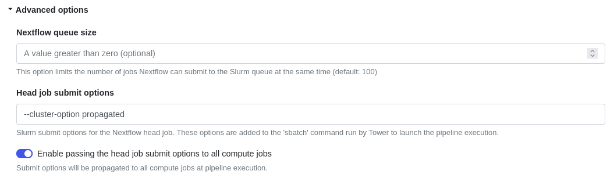

[IBM Spectrum LSF](https://www.ibm.com/products/hpc-workload-management/details) (Load Sharing Facility)is an IBM workload management solution for HPC. LSF aims to enhance user and administrator experience, reliability and performance at scale.

Tower streamlines the deployment of Nextflow pipelines into both cloud-based and on-prem LSF clusters.

## Requirements

To launch pipelines into an **LSF** cluster from Tower, the following requirements must be satisfied:

- The cluster should allow outbound connections to the Tower web service.
- The cluster queue used to run the Nextflow head job must be able to submit cluster jobs.
- The Nextflow runtime version **21.02.0-edge** (or later) must be installed on the cluster.

## Compute environment

To create a new compute environment for **LSF** in Tower:

1. In a workspace, select **Compute environments** and then **New environment**.

2. Enter a descriptive name for this environment, e.g., "LSF".

3. Select **IBM LSF** as the target platform.

4. Select your credentials, or select **+** and **SSH** or **Tower Agent** to add new credentials.

5. Enter a name for the credentials.

6. Enter the absolute path of the **Work directory** to be used on the cluster.

7. Enter the absolute path of the **Launch directory** to be used on the cluster. If omitted, it will be the same as the work directory.

8. Enter the **Login hostname**. This is usually the hostname or public IP address of the cluster's login node.

9. Enter the **Head queue name**. This is the cluster queue to which the Nextflow job will be submitted.

10. Enter the **Compute queue name**. This is the cluster queue to which the Nextflow job will submit tasks.

:::tip
The compute queue can be overridden by the Nextflow pipeline configuration. See the Nextflow [documentation](https://www.nextflow.io/docs/latest/process.html#queue) for more details.
:::

11. Expand **Staging options** to include optional pre- or post-run Bash scripts that execute before or after the Nextflow pipeline execution in your environment.

12. You can use the **Environment variables** option to specify custom environment variables for the Head job and/or Compute jobs.

13. Configure any advanced options described below, as needed.

14. Select **Create** to finalize the creation of the compute environment.

Jump to the documentation for [launching pipelines](../launch/launchpad.mdx).

### Advanced options

- Use the **Nextflow queue size** to limit the number of jobs that Nextflow can submit to the scheduler at the same time.

- Use the **Head job submit options** to specify LSF options for the head job. You can optionally apply these options to compute jobs as well:

  

- Use **Unit for memory limits**, **Per job memory limits**, and **Per task reserve** to control how memory is requested for Nextflow jobs.
