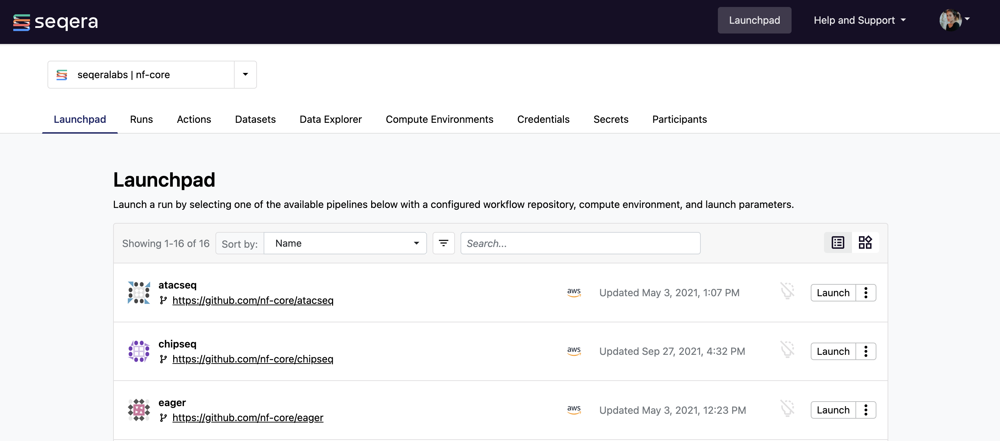
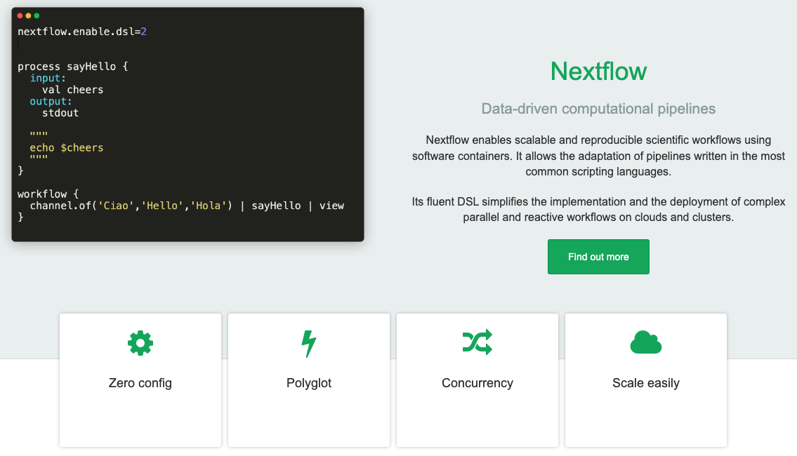

Seqera Platform Enterprise is the centralized command post for the management of [Nextflow](https://www.nextflow.io/) data pipelines. It brings monitoring, logging, and observability to distributed workflows and simplifies the deployment of pipelines on any cloud, cluster, or laptop.

Users can launch pre-configured pipelines with ease, while the flexible API provides programmatic integration to meet the needs of organizations building on Seqera Platform. Workflow developers can publish pipelines to shared workspaces and administrators can set up and manage the infrastructure required to run data analysis at scale.

### What is Nextflow?

Nextflow is a framework for the development of data workflows. It enables engineers and data scientists to create and securely deploy custom, parallel data applications to the cloud or traditional on-premises infrastructure. Nextflow is characterized by its powerful dataflow programming paradigm and execution engines that allow for transparent deployment.

Nextflow is both a programming workflow language and an execution runtime that supports a wide range of execution platforms, including popular traditional grid scheduling systems such as Slurm and IBM LSF, and cloud services such as AWS Batch and Google Cloud Life Sciences.

### Why Seqera Enterprise?

We created Nextflow in 2013 to deliver the most seamless experience for executing data workflows at scale. Seqera Enterprise is the continuation of that mission. Using the latest technologies, we have built the solution to easily execute and monitor pipelines across every stage. With Seqera, you can bring the cloud closer than ever before with automated resource provisioning and role-based access control (RBAC).

Seqera is designed to be easily configurable in any environment — data and compute never leave your organization's security boundary. It has been extensively tested with over 500 million jobs, achieving 99.99% uptime.

As mandated by healthcare industries to ensure compliance, the Seqera Platform is regularly submitted to penetration tests and security scanning. These tests meet the compliance standards set by ISO-27001, HIPAA, and HITRUST.

:::tip
Request a [**demo**](https://seqera.io/demo "Seqera Enterprise Demo") to explore using Seqera Enterprise in your own on-premises or cloud environment.
:::
