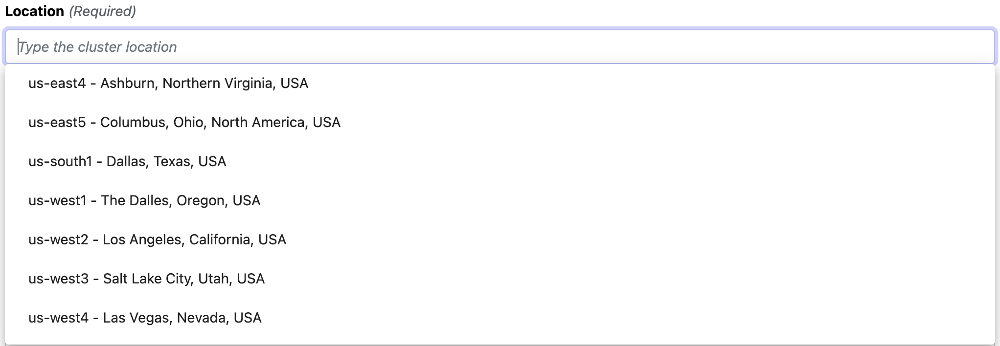

[Google Kubernetes Engine (GKE)](https://cloud.google.com/kubernetes-engine) is a managed Kubernetes cluster that allows the execution of containerized workloads in Google Cloud at scale.

Seqera Platform offers native support for GKE clusters to streamline the deployment of Nextflow pipelines.

## Requirements

See [here](../compute-envs/google-cloud-batch.mdx#configure-google-cloud) for instructions to set up your Google Cloud account and other services (such as Cloud storage).

You must have a GKE cluster up and running. Follow the [cluster preparation](../compute-envs/k8s.mdx#cluster-preparation) instructions to create the resources required by Seqera. In addition to the generic Kubernetes instructions, you must make a number of modifications specific to GKE.

### Service account role

You must grant cluster access to the service account used by the Seqera compute environment. To do this, update the [service account _RoleBinding_](https://cloud.google.com/kubernetes-engine/docs/how-to/role-based-access-control#rolebinding):

```yaml
cat << EOF | kubectl apply -f -
---
apiVersion: rbac.authorization.k8s.io/v1
kind: RoleBinding
metadata:
    name: tower-launcher-userbind
subjects:
    - kind: User
    name: <IAM SERVICE ACCOUNT>
    apiGroup: rbac.authorization.k8s.io
roleRef:
    kind: Role
    name: tower-launcher-role
    apiGroup: rbac.authorization.k8s.io
---
EOF
```

Replace `<IAM SERVICE ACCOUNT>` with the corresponding service account, e.g., `test-account@test-project-123456.google.com.iam.gserviceaccount.com`.

See [Role-based access control](https://cloud.google.com/kubernetes-engine/docs/how-to/role-based-access-control) for more information.

## Seqera compute environment

After you've prepared your Kubernetes cluster and granted cluster access to your service account, create a Seqera GKE compute environment:

1. In a Seqera workspace, select **Compute environments > New environment**.

2. Enter a descriptive name for this environment, e.g., _Google GKE (europe-west1)_.

3. From the **Provider** drop-down, select **Google GKE**.

4. Under **Storage**, select either **Fusion storage** (recommended) or **Legacy storage**. The [Fusion v2](../supported_software/fusion/fusion.mdx) virtual distributed file system allows access to your Google Cloud-hosted data (`gs://` URLs). This eliminates the need to configure a shared file system in your Kubernetes cluster. See [Fusion v2](#fusion-v2) below.

5. From the **Credentials** drop-down menu, select existing GKE credentials, or select **+** to add new credentials. If you choose to use existing credentials, skip to step 8.

6. Enter a name for the credentials, e.g., _GKE Credentials_.

7. Enter the **Service account key** for your Google service account.

:::tip
You can create multiple credentials in your Seqera environment. See [Credentials](../credentials/overview.mdx).
:::
8. Select the **Location** of your GKE cluster.

:::caution
GKE clusters can be either regional or zonal. For example, `us-west1` identifies the United States West-Coast _region_, which has three _zones_: `us-west1-a`, `us-west1-b`, and `us-west1-c`.

Seqera Platform's auto-completion only shows regions. You should manually edit this field if you're using a zonal GKE cluster.

:::

9. Select or enter the **Cluster name** of your GKE cluster.

10. Specify the **Namespace** created in the [cluster preparation](../compute-envs/k8s.mdx#cluster-preparation) instructions. This is _tower-nf_ by default.

11. Specify the **Head service account** created in the [cluster preparation](../compute-envs/k8s.mdx#cluster-preparation) instructions. This is _tower-launcher-sa_ by default.

:::note
If you enable Fusion v2 (**Fusion storage** in step 4 above), the head service account must have access to the Google Cloud storage bucket specified as your work directory.
:::

12. Specify the **Storage claim** created in the [cluster preparation](../compute-envs/k8s.mdx#cluster-preparation) instructions. This serves as a scratch filesystem for Nextflow pipelines. The storage claim is called _tower-scratch_ in the provided examples.

:::note
The **Storage claim** isn't needed when Fusion v2 is enabled.
:::

13. Apply [**Resource labels**](../resource-labels/overview.mdx) to the cloud resources consumed by this compute environment. Workspace default resource labels are prefilled.

14. Expand **Staging options** to include optional [pre- or post-run Bash scripts](../launch/advanced.mdx#pre--post-run-scripts) that execute before or after the Nextflow pipeline execution in your environment.

15. Specify custom **Environment variables** for the **Head job** and/or **Compute jobs*.

16. Configure any advanced options described in the next section, as needed.

17. Select **Create** to finalize the compute environment setup.

### Advanced options

Seqera Platform compute environments for GKE include advanced options for storage and work directory paths, resource allocation, and pod customization.

- The **Storage mount path** is the file system path where the Storage claim is mounted (default: `/scratch`).
- The **Work directory** is the file system path used as a working directory by Nextflow pipelines. It must be the storage mount path (default) or a subdirectory of it.
- The **Compute service account** is the service account used by Nextflow to submit tasks (default: the `default` account in the given namespace).
- The **Pod cleanup policy** determines when to delete terminated pods.
- Use **Custom head pod specs** to provide custom options for the Nextflow workflow pod (`nodeSelector`, `affinity`, etc). For example:

```yaml
spec:
    nodeSelector:
    disktype: ssd
```

- Use **Custom service pod specs** to provide custom options for the compute environment pod. See above for an example.
- Use **Head Job CPUs** and **Head Job Memory** to specify the hardware resources allocated for the Nextflow workflow pod.

<!--revisit for k8s CE pages consolidation:

Fusion v2 config options

Did you actually follow this steps during your review?

When I set up my EKS installation a while ago (following @bentsherman 's guide here: https://seqera.io/blog/deploying-nextflow-on-amazon-eks/) I ran into difficulties getting the Tower-EKS link up and had to go off-script to get things working.

We should probably verify nothing changes depending on EKS version (e.g. 1.25). @enekui-->

### Fusion v2

To use [Fusion v2](../supported_software/fusion/fusion.mdx) in your Seqera GKE compute environment, both the head service and compute service accounts must have access to the Google Cloud storage bucket specified as the work directory.

**Configure IAM to use Fusion v2**

1. Ensure the **Workload Identity** feature is enabled for the cluster:

- **Enable Workload Identity** in the cluster **Security** settings.
- **Enable GKE Metadata Server** in the node group **Security** settings.

2. Allow the IAM service account access to your Google storage bucket:

```shell
gcloud storage buckets add-iam-policy-binding gs://<YOUR-BUCKET> --role roles/storage.objectAdmin --member serviceAccount:<IAM-SERVICE-ACCOUNT>@<GOOGLE-CLOUD-PROJECT>.iam.gserviceaccount.com
```

The role must have at least `storage.objects.create`, `storage.objects.get`, and `storage.objects.list` permissions.

3. Allow the Kubernetes service account to impersonate the IAM service account:

```shell
gcloud iam service-accounts add-iam-policy-binding <IAM-SERVICE-ACCOUNT>@<GOOGLE-CLOUD-PROJECT>.iam.gserviceaccount.com --role roles/iam.workloadIdentityUser --member "serviceAccount:<GOOGLE-CLOUD-PROJECT>.svc.id.goog[<GKE-NAMESPACE>/<GKE-SERVICE-ACCOUNT>]"
```

4. Annotate the Kubernetes service account with the email address of the IAM service account:

```shell
kubectl annotate serviceaccount <GKE-SERVICE-ACCOUNT> --namespace <GKE-NAMESPACE> iam.gke.io/gcp-service-account=<IAM-SERVICE-ACCOUNT>@<GOOGLE-CLOUD-PROJECT>.iam.gserviceaccount.com
```

See the [GKE documentation](https://cloud.google.com/kubernetes-engine/docs/how-to/workload-identity#authenticating_to) for further details.
