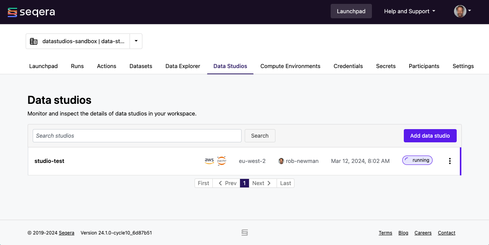
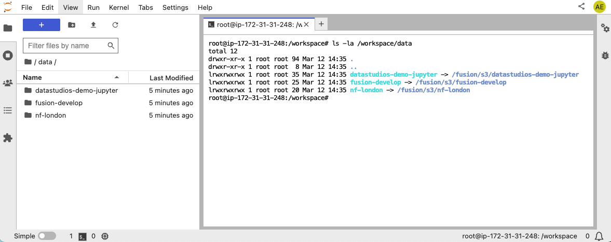

Data Studios is a unified platform where you can host a combination of container images and compute environments for interactive analysis using your preferred tools, like Jupyter notebooks, RStudio, and Visual Studio Code IDEs. Each data studio session is an individual interactive environment that encapsulates the live environment for dynamic data analysis.

:::note
Data Studios is currently in **private preview** and is not yet generally available. To request access, please contact your Seqera account manager.
:::

**Requirements**

Before you get started, ensure you have the following:

- Valid credentials to access your cloud storage data resources.
- At least the **Maintain** role set of permissions.
- A compute environment with sufficient resources. This is highly dependent on the volume of data you wish to process, but it's recommended to have at least 2 CPUs allocated with 8192 MB of memory. See [AWS Batch](https://docs.seqera.io/platform/23.3.0/compute-envs/aws-batch) for more information about compute environment configuration.

:::note
Currently, Data Studios only supports AWS Batch compute environments that **do not** have Fargate enabled.
:::

## Overview

Select the **Data Studios** tab to view all data studios. The list includes the name, cloud provider, analysis template, region, creator, creation date, and the status of each session. In this view, you can add a new data studio, as well as start, stop, and connect to an existing data studio. You can dynamically filter the list of data studio sessions using the search bar.

## Add a data studio

This functionality is available to users with the **Maintain** role and above.

1. Select **Add data studio**.
2. Select a container image template from the three options provided (JupyterLab, RStudio Server, or Visual Studio Code).
3. Select a compute environment. Currently, only AWS Batch is supported.
4. Mount data using Data Explorer: Select one or more datasets to mount. Datasets are mounted using the [Fusion file system](https://seqera.io/fusion) and are available at `/workspace/data/<dataset>`. Mounted data doesn't need to match the compute environment or region of the cloud provider of the data studio. However, this might cause increased costs or errors.
5. Optional: Enter CPU and memory allocations. The default values are 2 CPUs and 8192 MB memory (RAM).
6. Select **Add**.

You'll be returned to the Data Studios landing page that displays the list of data studios in your workspace. The data studio you created will be listed with the status **stopped**.

:::note
By default, Data Studios has read and write permissions to any mounted data path. This means that data can be written from the data studio session back to the cloud storage path mounted. To stop potential data loss, only one data studio session per workspace can mount a unique data path. When adding a new data studio, data paths already mounted to other running data studios are unavailable. If a new file is uploaded to the cloud storage bucket path while a session is running, the file may not be available to the data studio session immediately.
:::

### About container image templates

Data Studios currently provides three container image templates: JupyterLab, RStudio Server, and Visual Studio Code. The image templates install a very limited number of packages when the Data Studio session container is built.

**JupyterLab**

The following [conda-forge](https://conda-forge.org/) packages are available by default:

- `python`
- `pip`
- `jedi-language-server`
- `jupyterlab`
- `jupyter-collaboration`
- `jupyterlab-git`
- `jupytext`
- `jupyter-dash`
- `ipywidgets`
- `pandas[all]`
- `scikit-learn`
- `statsmodels`
- `itables`
- `seaborn[stats]`
- `altair`
- `plotly`
- `r-ggplot2`
- `nb_black`
- `qgrid`

To install additional packages, execute `!pip install <packagename>` commands in your notebook environment.

**RStudio Server**

To install packages, execute `install.packages("<packagename>")` commands in your notebook environment.

**Visual Studio Code**

To install extensions, click the **Extensions** button.

## Start a data studio

This functionality is available to users with the **Maintain** role and above.

A data studio needs to be started before you can connect to it. From the list in your workspace, select the three dots next to the status message for the data studio you want to start, then select **Start**. A new browser tab will open that displays the startup state of the data studio. Once the data studio has successfully started running, you can connect to it. A data studio will run until it is stopped manually or it encounters a technical issue.

:::note
A data studio session uses resources until it's **stopped**.
:::

Once a data studio session is in a **running** state, you can connect to it, obtain the public link to the session to share with collaborators inside your workspace, and stop it.

## Start an existing data studio as a new data studio

This functionality is available to users with the **Maintain** role and above.

You can use any existing data studio as the foundation for adding a new data studio. This functionality creates a clone of the data studio, including its checkpoint history, preserving any modifications made to the original data studio. When you create a data studio based in this way, future changes are isolated from the original data studio.

When adding a new data studio from an existing data studio or data studio checkpoint, the following fields are immutable:

- **Data studio template**
- **Original data studio and checkpoint**
- **Compute environment**

To add a new data studio from an existing **stopped** data studio, complete the following steps:

1. In a workspace, select **Data Studios**.
1. From the list of data studios in your workspace, select the three dots next to the status message for the data studio you want to start, then select **Start as new**. The **Add data studio** form opens.
1. Optional: In the **Add data studio** form, customize the following fields:
    - **Data studio name**
    - **Description**: By default, the parent data studio name(s).
    - **Mounted data**
    - **CPU**
    - **Memory**
1. Select **Add** to add the new data studio.

Additionally, you can add a new data studio from any existing data studio checkpoint except the currently running checkpoint. From the data studio detail page, select the **Checkpoints** tab and in the **Actions** column, select **Start as new data studio**. This is useful for tertiary analysis experimentation without impacting the state of the original data studio.

## Connect to a data studio

This functionality is available to all user roles excluding the **View** role.

To connect to a running data studio session, select the three dots next to the status message and choose **Connect**. A new browser tab will open, displaying the status of the data studio session. Select **Connect**.

:::warning
An active connection to a data studio session will not prevent administrative actions that might disrupt that connection. For example, a data studio can be stopped by another workspace user while you are in the session, the underlying credentials can be changed, or the compute environment can be deleted. These are independent actions and the user in the session won't be alerted to any changes - the only alert will be a server connection error in the session browser tab.
:::

Once connected, the data studio session list will update to display the status of `running` and any user connected to the session will have their avatar displayed under the status.

## Collaborate in a data studio

This functionality is available to all user roles excluding the **View** role.

To share a link to a running data studio with collaborators inside your workspace, select the three dots next to the status message for the data studio you want to share, then select **Copy data studio URL**. Using this link other authenticated users can access the session directly.

:::note
Collaborators need valid workspace permissions to connect to the running data studio.
:::

## Stop a data studio

This functionality is available to all user roles with the **Maintain** role and above.

To stop a running session, select the three dots next to the status message and then select **Stop**. The status will change from **running** to **stopped**. When a data studio session is stopped, the compute resources it's using are deallocated. You can stop a session at any time.

Stopping a running session creates a new checkpoint.

:::note
Make sure you save before you stop a data studio.
:::

## Restart a stopped data studio

This functionality is available to all user roles with the **Maintain** role and above.

When you restart a stopped session, the session uses the most recent checkpoint.

## Start a new data studio from a checkpoint

This functionality is available to all user roles with the **Maintain** role and above.

You can start a new data studio from an existing stopped data studio. This will inherit the history of the parent data studio checkpoint state. From the list of **stopped** data studios in your workspace, select the three dots next to the status message for the data studio and select **Start as new**. Alternatively, from the data studio detail page select the **Checkpoints** tab and choose a non-running checkpoint to start a new data studio from by clicking the three dots in the `Actions` column and selecting **Start as new**.

## Delete a data studio

This functionality is available to all user roles with the **Maintain** role and above.

You can only delete a data studio when it's **stopped**. Select the three dots next to the status message and then select **Delete**. The data studio is deleted immediately and can't be recovered.

## Data studio checkpoints

When you start a data studio, it automatically creates a *checkpoint*. A checkpoint saves changes that you make to the data studio root filesystem and stores it in the compute environment's pipeline work directory.

When you restart a data studio, or start a new data studio from a previously created checkpoint, changes such as installed software packages and configuration files are restored and made available in the data studio session. Changes made to mounted datasets are not included in a checkpoint.

## Data studio statuses

Data studios have the following possible statuses:

- **starting**: The data studio is initializing.
- **running**: When a data studio session is **running**, you can connect to it, copy the data studio URL, or stop it. In addition, the session can continue to process requests/run computations in the absence of an ongoing connection.
- **stopping**: The recently-running session is in the process of being stopped.
- **stopped**: When a session is stopped, the associated compute resources are deallocated and any unsaved state is lost. You can start a session or delete the data studio when it's in this state.
- **errored**: This state most often indicates that there has been an error starting the data studio but it is in a **stopped** state. There might be errors reported by the data studio session itself but these currently will be overwritten with a **running** status if the studio is still running. If you encounter an error with the private preview release of Data Studios, please reach out to your Seqera account manager.

## Troubleshooting

### Viewing all mounted datasets

In your tertiary analysis environment, open a new Terminal and type `ls -la /workspace/data`. This displays all the mounted datasets available in the current data studio session.

### My data studio is stuck in **starting** status

If your data studio doesn't advance from **starting** status to **running** status within 30 minutes, and you have access to the AWS Console for your organization, check that the AWS Batch compute environment associated with the session is in the **ENABLED** state with a **VALID** status. You can also check the **Compute resources** settings. Contact your organization's AWS administrator if you don't have access to the AWS Console.

If sufficient resources are not available, **Stop** your data studio and any others that may be running before trying again.

### My data studio status is **errored**

The **errored** status is generally related to issues encountered when creating the data studio resources in the compute environment (e.g., invalid credentials, insufficient permissions, network issues). It can also be related to insufficient compute resources, which are set in your compute environment configuration. Contact your organization's AWS administrator if you don't have access to the AWS Console. Please also reach out to your account manager so we can investigate the issue.

### My data studio can't be stopped

If you're not able to stop a data studio, it's usually because the job running the studio failed for some reason. In this case, and if you have access to the AWS Console for your organization, you can stop the data studio from the compute environment screen. Contact your organization's AWS administrator if you don't have access to the AWS Console. Also contact your Seqera account manager so we can investigate the issue.

### My data studio performance is poor

A slow or unresponsive data studio may be due to its AWS Batch compute environment being utilized for other jobs, such as running Nextflow pipelines. The compute environment is responsible for scheduling jobs to the available compute resources. Data studio sessions compete for resources with the Nextflow pipeline head job and Seqera does not currently have an established pattern of precedence.

If you have access to the AWS Console for your organization, check the jobs associated with the AWS Batch compute environment and compare with its **Compute resources** settings.

### What happens if the memory allocation of the data studio is exceeded?

The running container in the AWS Batch compute environment inherits the memory limits specified by the data studio configuration when adding or starting the session. The kernel then handles the memory as if running natively on Linux. Linux can overcommit memory, leading to possible out-of-memory errors in a container environment. The kernel has protections in place to prevent this, but it can happen, and in this case, the process is killed. This can manifest as a performance lag, killed subprocesses, or at worst, a killed data studio session.

### All my datasets are read-only

By default, AWS Batch compute environments that are created with Batch Forge restrict access to S3 to the working directory only, unless additional **Allowed S3 Buckets** are specified.
If the compute environment does not have write access to the mounted dataset, it will be mounted as read-only.
