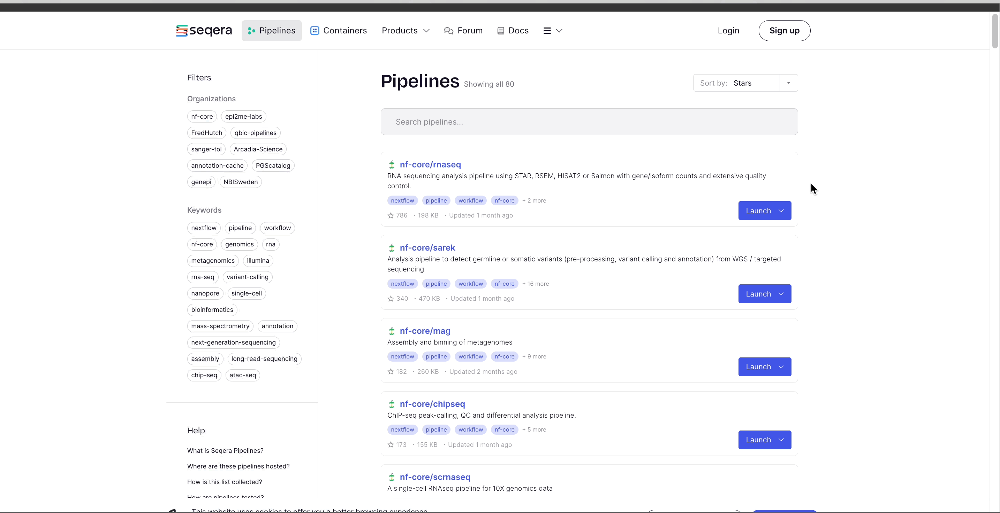
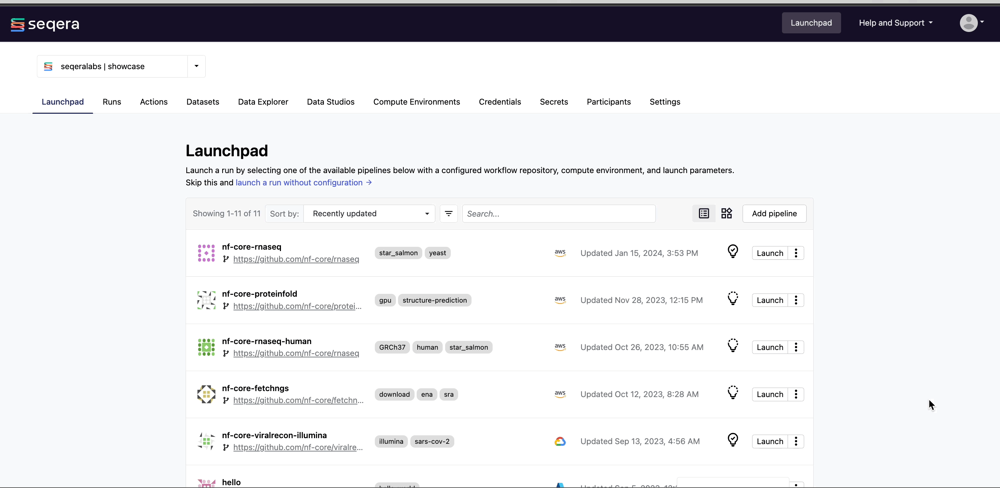

import Tabs from '@theme/Tabs';
import TabItem from '@theme/TabItem';

This guide details how to run bulk RNA sequencing data analysis, from quality control to differential expression analysis, on a cloud compute environment in Platform. It includes: 

- Creating a compute environment to run your pipeline
- Adding pipelines to your workspace 
- Importing your pipeline input data
- Launching the pipeline and monitoring execution from your workspace
- Setting up a tertiary analysis environment 
- Resource allocation guidance for RNA-seq data

:::info[**Prerequisites**]

You will need the following to get started:
- [Admin](../orgs-and-teams/roles.mdx) permissions in an existing organization workspace. See [Set up your workspace](./workspace-setup.mdx) to create an organization and workspace from scratch.
- An existing AWS, Azure, or Google cloud account with access to the cloud provider's Batch service.
- Existing access credentials with permissions to create and manage compute and storage resources in your cloud provider account.
:::

## Compute environment

Compute and storage requirements for RNA-seq analysis are dependent on the number of samples and the sequencing depth of your input data. See [RNA-seq data and requirements](#rna-seq-data-and-requirements) for details on RNA-seq datasets and the CPU and memory requirements for important steps of RNA-seq pipelines. 

:::note
The compute recommendations below are based on internal benchmarking performed by Seqera. Benchmark runs of [nf-core/rnaseq](https://github.com/nf-core/rnaseq) used profile `test_full`, consisting of an input dataset with 16 FASTQ files and a total size of approximately 123.5 GB. 
:::

#### Recommended compute environment resources

| **Setting**                    | **AWS Batch**                         | **GCP Batch**                 | **Azure Batch**                |
|--------------------------------|---------------------------------------|------------------------------|--------------------------------|
| **Instance Types**             | `m5.large` - `m5.2xlarge`             | `n2-standard-2` - `n2-standard-8`  | `Standard_D2s_v3` - `Standard_D8s_v3` |
| **vCPUs**                      | 2 - 8                                 | 2 - 8                         | 2 - 8                          |
| **Memory (GiB)**               | 8 - 32                                | 8 - 32                        | 8 - 32                         |
| **Max CPUs**                   | >500                                  | >500                          | >500                           |
| **Min CPUs**                   | 0                                     | 0                             | 0                              |

### Create compute environment

From the **Compute Environments** tab in your organization workspace, select **Add compute environment** and complete the following fields:

<Tabs>
<TabItem value="AWS Batch" label="AWS Batch" default>

| **Field**                             | **Description**                                            |
|---------------------------------------|------------------------------------------------------------|
| **Name**                              | A unique name for the compute environment.                 |
| **Platform**                          | AWS Batch                                                  |
| **Credentials**                       | Select existing credentials, or **+** to create new credentials:|
|                                       | **Access Key:** AWS access key ID                          |
|                                       | **Secret Key:** AWS secret access key                      |
| **Region**                            | The target execution region.                               |
| **Pipeline work directory**           | An S3 bucket path in the same execution region.            |
| **Enable Wave Containers**            | Use the Wave containers service to provision containers.   |
| **Enable Fusion v2**                  | Access your S3-hosted data via the Fusion v2 file system.  |
| **Enable Fast Instance Storage**      | Use NVMe instance storage to speed up I/O and disk access. Requires Fusion v2.|
| **Config Mode**                       | Batch Forge                                                |
| **Provisioning Model**                | Choose between Spot and On-demand instances.               |
| **Max CPUs**                          | Sensible values for production use range between 2000 and 5000.|


</TabItem>
<TabItem value="Azure Batch" label="Azure Batch" default>

| **Field**                             | **Description**                                            |
|---------------------------------------|------------------------------------------------------------|
| **Name**                              | A unique name for the compute environment.                 |
| **Platform**                          | Azure Batch                                                |
| **Credentials**                       | Select existing credentials, or **+** to create new credentials:|
|                                       | **Batch Account Name:** The Azure Batch account name       |
|                                       | **Batch Account Key:** The Azure Batch account key         |
|                                       | **Blob Storage Account Name:** Azure Blob storage account name |
|                                       | **Blob Storage Account Key:** Azure Blob storage account key |
| **Location**                          | The target execution region.                               |
| **Pipeline Work Directory**           | An Azure Blob storage path in the same execution region.   |
| **Enable Wave Containers**            | Use the Wave containers service to provision containers.   |
| **Enable Fusion v2**                  | Access your Blob storage data via the Fusion v2 file system.|
| **Config Mode**                       | Batch Forge                                                |
| **VMs Type**                          | Azure Batch VM type. Uses Standard_D4_v3 VMs if ommitted.  |

</TabItem>
<TabItem value="Google Cloud Batch" label="Google Cloud Batch" default>

| **Field**                             | **Description**                                            |
|---------------------------------------|------------------------------------------------------------|
| **Name**                              | A unique name for the compute environment.                 |
| **Platform**                          | Google Cloud Batch                                         |
| **Credentials**                       | Select existing credentials, or **+** to create new credentials:|
| **Credentials**                       | **Service Account Key:** Service account JSON key file.    |
| **Location**                          | The target execution region.                               |
| **Pipeline Work Directory**           | A Google Cloud Storage path in the same execution region.  |
| **Enable Wave Containers**            | Use the Wave containers service to provision containers.   |
| **Enable Fusion v2**                  | Access your Google Cloud storage data via the Fusion v2 file system.|
| **Spot**                              | Toggle to use Spot instances.                              |

</TabItem>
</Tabs>

## Add pipeline to Platform 

:::info
The [nf-core/rnaseq](https://github.com/nf-core/rnaseq) pipeline is a highly configurable and robust workflow designed to analyze RNA sequencing (RNA-seq) data. It performs quality control, alignment, quantification, and differential expression analysis.
:::

[Seqera Pipelines](https://seqera.io/pipelines) is an open-source resource that provides a curated collection of high-quality, open-source pipelines that can be imported directly to your workspace Launchpad in Platform. Each pipeline includes a curated test dataset to use in a test run to confirm compute environment compatibility in just a few steps.

To use Seqera Pipelines to import the `nf-core-rnaseq` pipeline to your workspace Launchpad:



1. Search for `nf-core-rnaseq` and select **Launch** next to the pipeline name in the list. In the **Add pipeline** tab, select **Cloud** or **Enterprise** depending on your Platform account type, then provide the information needed for Seqera Pipelines to access your Platform instance:
    - **Seqera Cloud**: Paste your Platform **Access token** and select **Next**.  
    - **Seqera Enterprise**: Specify the **Seqera Platform URL** (hostname) and **Base API URL** for your Enterprise instance, then paste your Platform **Access token** and select **Next**.
    :::tip
    If you do not have a Platform access token, select **Get your access token from Seqera Platform** to open the Access tokens page in a new browser tab.
    :::
1. Select your Platform **Organization**, **Workspace**, and **Compute environment** for the imported pipeline. 
1. (Optional) Customize the **Pipeline Name** and **Pipeline Description**.
1. Select **Add Pipeline**. 

:::info
To add a custom pipeline not listed in Seqera Pipelines to your Platform workspace, see [Add pipelines](./quickstart-demo/add-pipelines.mdx#) for manual Launchpad instructions. 
:::

## Pipeline input data

The [nf-core/rnaseq](https://github.com/nf-core/rnaseq) pipeline works with input datasets (samplesheets) containing sample names, FASTQ file locations, and indications of strandedness. 

<details>
  <summary>**Example nf-core/rnaseq dataset**</summary>
    
  | sample              | fastq_1                              | fastq_2                              | strandedness |
  | ------------------- | ------------------------------------ | ------------------------------------ | ------------ |
  | WT_REP1             | s3://nf-core-awsmegatests/rnaseq/... | s3://nf-core-awsmegatests/rnaseq/... | reverse      |
  | WT_REP1             | s3://nf-core-awsmegatests/rnaseq/... | s3://nf-core-awsmegatests/rnaseq/... | reverse      |
  | WT_REP2             | s3://nf-core-awsmegatests/rnaseq/... | s3://nf-core-awsmegatests/rnaseq/... | reverse      |
  | RAP1_UNINDUCED_REP1 | s3://nf-core-awsmegatests/rnaseq/... |                                      | reverse      |
  | RAP1_UNINDUCED_REP2 | s3://nf-core-awsmegatests/rnaseq/... |                                      | reverse      |
  | RAP1_UNINDUCED_REP2 | s3://nf-core-awsmegatests/rnaseq/... |                                      | reverse      |
  | RAP1_IAA_30M_REP1   | s3://nf-core-awsmegatests/rnaseq/... | s3://nf-core-awsmegatests/rnaseq/... | reverse      |

</details>

In Platform, samplesheets and other data can be made easily accessible in one of two ways: 
- Use **Data Explorer** to browse and interact with remote data from AWS S3, Azure Blob Storage, and Google Cloud Storage repositories, directly in your organization workspace.
- Use **Datasets** to upload structured data to your workspace in CSV (Comma-Separated Values) or TSV (Tab-Separated Values) format.

<details>
  <summary>**Add a cloud bucket via Data Explorer**</summary> 

  Private cloud storage buckets accessible to the credentials in your workspace are added to Data Explorer automatically by default. However, you can also add custom directory paths within buckets to your workspace to simplify direct access.

  To add individual buckets (or directory paths within buckets):

  1. From the **Data Explorer** tab, select **Add cloud bucket**. 
  1. Specify the bucket details:
      - The cloud **Provider**.
      - An existing cloud **Bucket path**.
      - A unique **Name** for the bucket.
      - The **Credentials** used to access the bucket. For public cloud buckets, select **Public** from the dropdown menu.
      - An optional bucket **Description**.
  1. Select **Add**.

    

  You can now select data directly from this bucket as input when launching your pipeline, without the need to interact with cloud consoles or CLI tools. 

</details>

<details>
  <summary>**Add a dataset**</summary>

  From the **Datasets** tab, select **Add Dataset**.

  

  Specify the following dataset details:

  - A **Name** for the dataset, such as `nf-core-rnaseq-dataset`.
  - A **Description** for the dataset.
  - Select the **First row as header** option to prevent Platform from parsing the header row of the samplesheet as sample data.
  - Select **Upload file** and browse to your CSV or TSV samplesheet file in local storage, or simply drag and drop it into the box.

  The dataset is now listed in your organization workspace datasets and can be selected as input when launching your pipeline. 

  :::info
  Platform does not store the data used for analysis in pipelines. The datasets must provide the locations of data that is stored on your own infrastructure.
  :::

</details>

## Launch pipeline

With your compute environment created, nf-core/rnaseq added to your workspace Launchpad, and your samplesheet accessible in Platform, you are ready to launch your pipeline. Navigate to the Launchpad and select **Launch** next to `nf-core-rnaseq` to open the launch form.

 

Enter a unique run name and add new or existing labels to the run for easy categorization, before specifying your pipeline inputs and outputs:

<details>
  <summary>**input**</summary>

  Use **Browse** to select your pipeline input data: 

  - In the **Data Explorer** tab, select the existing cloud bucket that contains your samplesheet, then browse or search for the samplesheet file to select it as input.
  - In the **Datasets** tab, search for and select your existing dataset.

  

</details>
<details>
  <summary>**outdir**</summary>

  Use the `outdir` parameter to specify where the final results created by the pipeline are published. `outdir` must be unique for each pipeline run. Otherwise, your results will be overwritten. 

  Select **Browse** to specify a cloud storage directory using Data Explorer, or enter a cloud storage directory path to publish pipeline results to manually.

  

</details>

#### Pipeline-specific parameters

Modify other parameters to customize the pipeline execution through the parameters form. For example, under **Read trimming options**, change the `trimmer` to select `fastp` in the dropdown menu instead of `trimgalore`.


Select **Launch** to start the run and be directed to the **Runs** tab with your run in a **submitted** status at the top of the list.

## Run monitoring

Select your new run from the **Runs** tab list to view the run details.

#### Run details page

As the pipeline runs, run details will populate with the following tabs:

- **Command-line**: The Nextflow command invocation used to run the pipeline. This includes details about the pipeline version (`-r` flag) and profile, if specified (`-profile` flag).
- **Parameters**: The exact set of parameters used in the execution. This is helpful for reproducing the results of a previous run.
- **Resolved Nextflow configuration**: The full Nextflow configuration settings used for the run. This includes parameters, but also settings specific to task execution (such as memory, CPUs, and output directory).
- **Execution Log**: A summarized Nextflow log providing information about the pipeline and the status of the run.
- **Datasets**: Link to datasets, if any were used in the run.
- **Reports**: View pipeline outputs directly in the Platform.


### View reports

Most Nextflow pipelines generate reports or output files which are useful to inspect at the end of the pipeline execution. Reports can contain quality control (QC) metrics that are important to assess the integrity of the results.


For example, for the nf-core/rnaseq pipeline, view the [MultiQC](../../../multiqc_docs/multiqc_repo/docs/markdown/index.mdx) report generated. MultiQC is a helpful reporting tool to generate aggregate statistics and summaries from bioinformatics tools.


The paths to report files point to a location in cloud storage (in the `outdir` directory specified during launch), but you can view the contents directly and download each file without navigating to the cloud or a remote filesystem.

#### Specify outputs in reports

To customize and instruct Platform where to find reports generated by the pipeline, a [tower.yml](https://github.com/nf-core/rnaseq/blob/master/tower.yml) file that contains the locations of the generated reports must be included in the pipeline repository. 

In the nf-core/rnaseq pipeline, the MULTIQC process step generates a MultiQC report file in HTML format:

```yaml
reports:
  multiqc_report.html:
    display: "MultiQC HTML report"
```

:::info
See [Reports](../reports/overview.mdx) to configure reports for pipeline runs in your own workspace. 
:::

#### View general information

The run details page includes general information about who executed the run and when, the Git hash and tag used, and additional details about the compute environment and Nextflow version used.


The **General** panel displays top-level information about a pipeline run:

- Unique workflow run ID
- Workflow run name
- Timestamp of pipeline start
- Pipeline version and Git commit ID
- Nextflow session ID
- Username of the launcher
- Work directory path

#### View details for a task

Scroll down the page to view:

- The progress of individual pipeline **Processes**
- **Aggregated stats** for the run (total walltime, CPU hours)
- **Workflow metrics** (CPU efficiency, memory efficiency)
- A **Task details** table for every task in the workflow

The task details table provides further information on every step in the pipeline, including task statuses and metrics.

#### Task details

Select a task in the task table to open the **Task details** dialog. The dialog has three tabs: **About**, **Execution log**, and **Data Explorer**.

The **About** tab includes:

1. **Name**: Process name and tag
2. **Command**: Task script, defined in the pipeline process
3. **Status**: Exit code, task status, and number of attempts
4. **Work directory**: Directory where the task was executed
5. **Environment**: Environment variables that were supplied to the task
6. **Execution time**: Metrics for task submission, start, and completion time
7. **Resources requested**: Metrics for the resources requested by the task
8. **Resources used**: Metrics for the resources used by the task


#### Execution log

The **Execution log** tab provides a real-time log of the selected task's execution. Task execution and other logs (such as stdout and stderr) are available for download from here, if still available in your compute environment.

#### Task work directory in Data Explorer

If a task fails, a good place to begin troubleshooting is the task's work directory.

Nextflow hash-addresses each task of the pipeline and creates unique directories based on these hashes. Instead of navigating through a bucket on the cloud console or filesystem to find the contents of this directory, use the **Data Explorer** tab in the Task window to view the work directory.

Data Explorer allows you to view the log files and output files generated for each task in its working directory, directly within Platform. You can view, download, and retrieve the link for these intermediate files in cloud storage from the **Data Explorer** tab to simplify troubleshooting.


## Tertiary analysis

Set up an environment for tertiary analysis of your pipeline data and enable collaboration with other workspace participants. 

Tertiary analysis of pipeline results is often performed in platforms like Jupyter Notebook or RStudio. Setting up the infrastructure for these platforms, including accessing pipeline data and the necessary bioinformatics packages, can be complex and time-consuming.

**Data Studios** streamlines the process of creating interactive analysis environments for Platform users. With built-in templates for platforms like Jupyter Notebook, RStudio, and VSCode, creating a data studio is as simple as adding and sharing pipelines or datasets.

### Create an RStudio analysis environment with Data Studios

From the **Data Studios** tab, select **Add a data studio** and complete the following:
- Select the latest **RStudio** container image template from the dropdown list.
- Select an AWS Batch compute environment. 
:::note
Data studios compete for computing resources when sharing compute environments. Ensure your compute environment has sufficient resources to run both your pipelines and data studio sessions. The default CPU and memory allocation for data studios is 2 CPUs and 8192 MB RAM. 
:::
- Mount data using Data Explorer: Mount the S3 bucket or directory path that contains the output data of your RNA-seq run. 
- Optional: Enter CPU and memory allocations. The default values are 2 CPUs and 8192 MB memory (RAM).
- Select **Add**.
- Once the data studio has been created, select the options menu next to it and select **Start**.
- When the data studio is in a running state, **Connect** to it. 

### Configure the data studio environment

The RStudio environment can be configured with the packages you wish to install and the R scripts you wish to run. For the purpoises of this guide, the following environment configuration can be used to analyze the gene level counts of your RNA-seq data:

```console
# Adapted from source: https://combine-australia.github.io/RNAseq-R/09-applying-rnaseq-solutions.html

# Install libraries and packages
install.packages("BiocManager")
BiocManager::install(c("limma"))
BiocManager::install(c("edgeR"))
BiocManager::install(c("org.Dm.eg.db"))
BiocManager::install(c("gplots"))
BiocManager::install(c("RColorBrewer"))
library(limma)
library(edgeR)
library(gplots)
library(RColorBrewer)
library(org.Dm.eg.db)

# Read data
counts <- read.delim(file="/workspace/data/<PATH_TO_YOUR_COUNTS_FILE>")
targets <- read.delim(file="/workspace/data/<PATH_TO_YOUR_SAMPLE_INFO_FILE>")
# Confirm data was read correctly
head(counts)
targets
# Filter out lowly expressed genes
table(targets$Group)
# Check relationship between CPM and samples
mycpm <- cpm(counts)
plot(counts[,1],mycpm[,1],xlim=c(0,20),ylim=c(0,5))
abline(v=10,col=2)
abline(h=2,col=4)
# Filter on a CPM of 2 or 3 in at least 3 samples
thresh <- mycpm > 2
keep <- rowSums(thresh) >= 3
table(keep)
counts.keep <- counts[keep,]
dim(counts.keep)
y <- DGEList(counts.keep)
# Plot library sizes
barplot(y$samples$lib.size)

par(mfrow=c(1,1))
# Get log2 counts per million
logcpm <- cpm(y$counts,log=TRUE)
# Check distributions of samples using boxplots
boxplot(logcpm, xlab="", ylab="Log2 counts per million",las=2,outline=FALSE)
# Add a blue horizontal line that corresponds to the median logCPM
abline(h=median(logcpm),col="blue")
title("Boxplots of logCPMs (unnormalised)")

par(mfrow=c(1,2),oma=c(2,0,0,0))
group.col <- c("red","blue")[targets$Group]
boxplot(logcpm, xlab="", ylab="Log2 counts per million",las=2,col=group.col,
        pars=list(cex.lab=0.8,cex.axis=0.8))
abline(h=median(logcpm),col="blue")
title("Boxplots of logCPMs\n(coloured by groups)",cex.main=0.8)

lib.col <- c("light pink","light green")[targets$Library]
boxplot(logcpm, xlab="", ylab="Log2 counts per million",las=2, col=lib.col,
        pars=list(cex.lab=0.8,cex.axis=0.8))
abline(h=median(logcpm),col="blue")
title("Boxplots of logCPMs\n(coloured by library prep)",cex.main=0.8)

par(mfrow=c(1,2))
plotMDS(y,col=group.col)
legend("topright",legend=levels(targets$Group),fill=c("red","blue"))
plotMDS(y,col=lib.col)
legend("topleft",legend=levels(targets$Library),fill=c("light pink","light green"))

logcounts <- cpm(y,log=TRUE)
var_genes <- apply(logcounts, 1, var)
select_var <- names(sort(var_genes, decreasing=TRUE))[1:500]

highly_variable_lcpm <- logcounts[select_var,]
dim(highly_variable_lcpm)
mypalette <- brewer.pal(11,"RdYlBu")
morecols <- colorRampPalette(mypalette)
heatmap.2(highly_variable_lcpm,col=rev(morecols(50)),trace="none", main="Top 500 most variable genes across samples",ColSideColors=group.col,scale="row",margins=c(10,5))
```

Customize the configuration to use your pipeline data by specifying your `<PATH_TO_YOUR_COUNTS_FILE>` and `<PATH_TO_YOUR_SAMPLE_INFO_FILE>`.

### Explore results


### Collaborate in the data studio

To share the results of your RNAseq analysis or allow colleagues to perform exploratory analysis, share a link to the data studio by selecting the options menu for the data studio you want to share, then select **Copy data studio URL**. With this link, other authenticated users with the **Connect** [role](../orgs-and-teams/roles.mdx) (or greater) can access the session directly.

### Pipeline optimization 

Seqera Platform's task-level resource usage metrics allow you to determine the resources requested for a task and what was actually used. This information helps you fine-tune your configuration more accurately.

However, manually adjusting resources for every task in your pipeline is impractical. Instead, you can leverage the pipeline optimization feature on the Launchpad.

Pipeline optimization analyzes resource usage data from previous runs to optimize the resource allocation for future runs. After a successful run, optimization becomes available, indicated by the lightbulb icon next to the pipeline turning black.

#### Optimize nf-core/rnaseq

Navigate back to the Launchpad and select the lightbulb icon next to nf-core/rnaseq to view the optimized profile. You have the flexibility to tailor the optimization's target settings and incorporate a retry strategy as needed.

#### View optimized configuration

When you select the lightbulb, you can access an optimized configuration profile in the second tab of the **Customize optimization profile** window.

This profile consists of Nextflow configuration settings for each process and each resource directive (where applicable):  **cpus**, **memory**, and **time**. The optimized setting for a given process and resource directive is based on the maximum use of that resource across all tasks in that process.

Once optimization is selected, subsequent runs of that pipeline will inherit the optimized configuration profile, indicated by the black lightbulb icon with a checkmark. 

:::info 
Optimization profiles are generated from one run at a time, defaulting to the most recent run, and _not_ an aggregation of previous runs.
:::


Verify the optimized configuration of a given run by inspecting the resource usage plots for that run and these fields in the run's task table:

| Description  | Key                    |
| ------------ | ---------------------- |
| CPU usage    | `pcpu`                 |
| Memory usage | `peakRss`              |
| Runtime      | `start` and `complete` |

## RNA-seq data and requirements

RNA-seq data typically consists of raw sequencing reads from high-throughput sequencing technologies like Illumina. These reads are used to quantify gene expression levels and discover novel transcripts. A typical RNA-seq dataset can range from a few GB to several hundred GB, depending on the number of samples and the sequencing depth.

For example, the publicly available 1000 Genomes dataset contains RNA-seq data for over 2500 samples, with low-coverage individual FASTQ files ranging from 30 to 50 GB in size.

#### Pipeline Steps and Computing Resource Requirements

The nf-core/rnaseq pipeline involves several key steps, each with distinct computational requirements:

| **Pipeline step**                   | **Tools**                 | **Resource needs**           | **Description**                                                                                   |
|-------------------------------------|---------------------------|------------------------------|---------------------------------------------------------------------------------------------------|
| **Quality Control (QC)**            | FastQC, MultiQC           | Moderate CPU, low memory     | Initial quality checks of raw reads to assess sequencing quality and identify potential issues.   |
| **Read Trimming**                   | Trim Galore!              | Moderate CPU, moderate memory| Removal of adapter sequences and low-quality bases to prepare reads for alignment.               |
| **Read Alignment**                  | HISAT2, STAR              | High CPU, high memory        | Alignment of trimmed reads to a reference genome, typically the most resource-intensive step.    |
| **Quantification**                  | featureCounts, Salmon     | Moderate CPU, moderate memory| Counting the number of reads mapped to each gene or transcript to measure expression levels.     |
| **Differential Expression Analysis**| DESeq2, edgeR             | Low CPU, moderate memory     | Statistical analysis to identify genes with significant changes in expression between conditions. |

#### Benchmarking

TODO