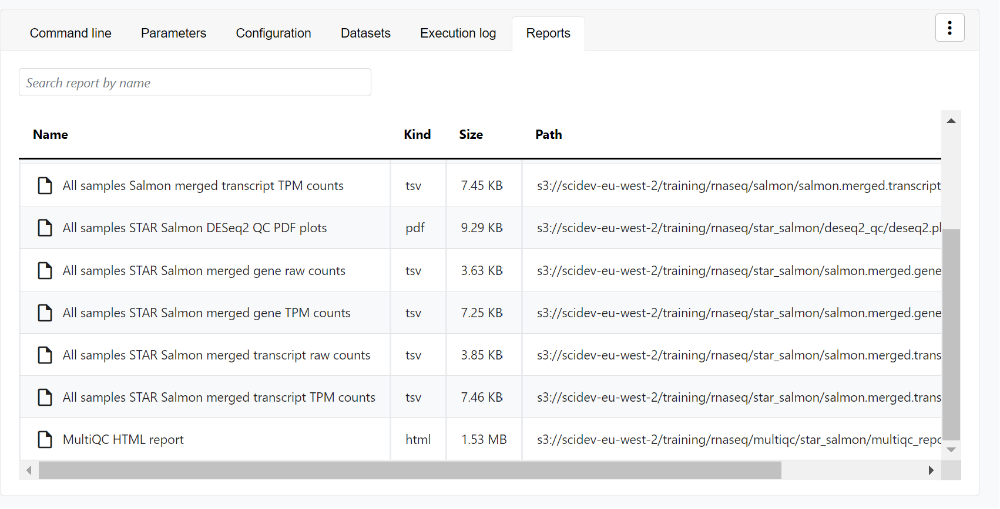

import Tabs from '@theme/Tabs';
import TabItem from '@theme/TabItem';

This guide details how to run bulk RNA sequencing (RNA-Seq) data analysis, from quality control to differential expression analysis, on an AWS Batch compute environment in Platform. It includes: 

- Creating an AWS Batch compute environment to run your pipeline and analysis environment
- Adding pipelines to your workspace 
- Importing your pipeline input data
- Launching the pipeline and monitoring execution from your workspace
- Setting up a custom analysis environment with Data Studios
- Resource allocation guidance for RNA-Seq data

:::info[**Prerequisites**]
You will need the following to get started:

- [Admin](../orgs-and-teams/roles.mdx) permissions in an existing organization workspace. See [Set up your workspace](./workspace-setup.mdx) to create an organization and workspace from scratch.
- An existing AWS cloud account with access to the AWS Batch service.
- Existing access credentials with permissions to create and manage resources in your AWS account. See [IAM](../compute-envs/aws-batch.mdx#iam) for guidance to set up IAM permissions for Platform. 
:::

## Compute environment

Compute and storage requirements for RNA-Seq analysis are dependent on the number of samples and the sequencing depth of your input data. See [RNA-Seq data and requirements](#rna-seq-data-and-requirements) for details on RNA-Seq datasets and the CPU and memory requirements for important steps of RNA-Seq pipelines. 

In this guide, you will create an AWS Batch compute environment with sufficient resources allocated to run the [nf-core/rnaseq](https://github.com/nf-core/rnaseq) pipeline with a large (123.5 GB) dataset. This compute environment will also be used to run a Data Studios RStudio environment for tertiary analysis of the resulting pipeline data. 

:::note
The compute recommendations below are based on internal benchmarking performed by Seqera. Benchmark runs of [nf-core/rnaseq](https://github.com/nf-core/rnaseq) used profile `test_full`, consisting of an input dataset with 16 FASTQ files (8 paired-end samples) and a total size of approximately 123.5 GB. 
:::

### Recommended compute environment resources

The following compute resources are recommended for production RNA-Seq pipelines, depending on the size of your input dataset:

| **Setting**                    | **Value**                             |
|--------------------------------|---------------------------------------|
| **Instance Types**             | `m5,r5`             |
| **vCPUs**                      | 2 - 8                                 |
| **Memory (GiB)**               | 8 - 32                                |
| **Max CPUs**                   | >500                                  |
| **Min CPUs**                   | 0                                     |

#### Fusion file system 

The [Fusion](../supported_software/fusion/fusion.mdx) file system enables seamless read and write operations to cloud object stores, leading to
simpler pipeline logic and faster, more efficient execution. While Fusion is not required to run nf-core/rnaseq, it is recommended for optimal performance. See [nf-core/rnaseq performance in Platform](#nf-corernaseq-performance-in-platform) at the end of this guide.

Fusion works best with AWS NVMe instances (fast instance storage) as this delivers the fastest performance when compared to environments using only AWS EBS (Elastic Block Store). Batch Forge selects instances automatically based on your compute environment configuration, but you can optionally specify instance types. To enable fast instance storage (see Create compute environment below), you must select EC2 instances with NVMe SSD storage (`m5d` or `r5d` families). 

:::note 
Fusion requires a license for use in Seqera Platform compute environments or directly in Nextflow. Fusion can be trialed at no cost. [Contact Seqera](https://seqera.io/contact-us/) for more details.
:::

### Create compute environment


From the **Compute Environments** tab in your organization workspace, select **Add compute environment** and complete the following fields:

| **Field**                             | **Description**                                            |
|---------------------------------------|------------------------------------------------------------|
| **Name**                              | A unique name for the compute environment.                 |
| **Platform**                          | AWS Batch                                                  |
| **Credentials**                       | Select existing credentials, or **+** to create new credentials:|
| **Access Key**                        | AWS access key ID.                                         |
| **Secret Key**                        | AWS secret access key.                                     |
| **Region**                            | The target execution region.                               |
| **Pipeline work directory**           | An S3 bucket path in the same execution region.            |
| **Enable Wave Containers**            | Use the Wave containers service to provision containers.   |
| **Enable Fusion v2**                  | Access your S3-hosted data via the Fusion v2 file system.  |
| **Enable fast instance storage**      | Use NVMe instance storage to speed up I/O and disk access. Requires Fusion v2.|
| **Config Mode**                       | Batch Forge                                                |
| **Provisioning Model**                | Choose between Spot and On-demand instances.               |
| **Max CPUs**                          | Sensible values for production use range between 2000 and 5000.|
| **Enable Fargate for head job**       | Run the Nextflow head job using the Fargate container service to speed up pipeline launch. Requires Fusion v2.|
| **Allowed S3 buckets**                | Additional S3 buckets or paths to be granted read-write permission for this compute environment. Add data paths to be mounted in your data studio here, if different from your pipeline work directory.|
| **Resource labels**                   | `name=value` pairs to tag the AWS resources created by this compute environment.|


## Add pipeline to Platform 

:::info
The [nf-core/rnaseq](https://github.com/nf-core/rnaseq) pipeline is a highly configurable and robust workflow designed to analyze RNA-Seq data. It performs quality control, alignment and quantification.


:::

[Seqera Pipelines](https://seqera.io/pipelines) is a curated collection of quality open-source pipelines that can be imported directly to your workspace Launchpad in Platform. Each pipeline includes a curated test dataset to use in a test run to confirm compute environment compatibility in just a few steps.

To use Seqera Pipelines to import the `nf-core/rnaseq` pipeline to your workspace:


1. Search for `nf-core/rnaseq` and select **Launch** next to the pipeline name in the list. In the **Add pipeline** tab, select **Cloud** or **Enterprise** depending on your Platform account type, then provide the information needed for Seqera Pipelines to access your Platform instance:
    - **Seqera Cloud**: Paste your Platform **Access token** and select **Next**.  
    - **Seqera Enterprise**: Specify the **Seqera Platform URL** (hostname) and **Base API URL** for your Enterprise instance, then paste your Platform **Access token** and select **Next**.
    :::tip
    If you do not have a Platform access token, select **Get your access token from Seqera Platform** to open the Access tokens page in a new browser tab.
    :::
1. Select your Platform **Organization**, **Workspace**, and **Compute environment** for the imported pipeline. 
1. (Optional) Customize the **Pipeline Name** and **Pipeline Description**.
1. Select **Add Pipeline**. 

:::info
To add a custom pipeline not listed in Seqera Pipelines to your Platform workspace, see [Add pipelines](./quickstart-demo/add-pipelines.mdx#) for manual Launchpad instructions. 
:::

## Pipeline input data

The [nf-core/rnaseq](https://github.com/nf-core/rnaseq) pipeline works with input datasets (samplesheets) containing sample names, FASTQ file locations (paths to FASTQ files in cloud or local storage), and strandedness. For example, the dataset used in the `test_full` profile is derived from the publicly available iGenomes collection of datasets, commonly used in bioinformatics analyses. 

This dataset represents RNA-Seq samples from various human cell lines (GM12878, K562, MCF7, and H1) with biological replicates, stored in an AWS S3 bucket (`s3://ngi-igenomes`) as part of the iGenomes resource. These RNA-Seq datasets consist of paired-end sequencing reads, which can be used to study gene expression patterns in different cell types.

<details>
  <summary>**nf-core/rnaseq test_full profile dataset**</summary>
    
  | sample | fastq_1 | fastq_2 | strandedness |
  |--------|---------|---------|--------------|
  | GM12878_REP1 | s3://ngi-igenomes/test-data/rnaseq/SRX1603629_T1_1.fastq.gz | s3://ngi-igenomes/test-data/rnaseq/SRX1603629_T1_2.fastq.gz | reverse |
  | GM12878_REP2 | s3://ngi-igenomes/test-data/rnaseq/SRX1603630_T1_1.fastq.gz | s3://ngi-igenomes/test-data/rnaseq/SRX1603630_T1_2.fastq.gz | reverse |
  | K562_REP1 | s3://ngi-igenomes/test-data/rnaseq/SRX1603392_T1_1.fastq.gz | s3://ngi-igenomes/test-data/rnaseq/SRX1603392_T1_2.fastq.gz | reverse |
  | K562_REP2 | s3://ngi-igenomes/test-data/rnaseq/SRX1603393_T1_1.fastq.gz | s3://ngi-igenomes/test-data/rnaseq/SRX1603393_T1_2.fastq.gz | reverse |
  | MCF7_REP1 | s3://ngi-igenomes/test-data/rnaseq/SRX2370490_T1_1.fastq.gz | s3://ngi-igenomes/test-data/rnaseq/SRX2370490_T1_2.fastq.gz | reverse |
  | MCF7_REP2 | s3://ngi-igenomes/test-data/rnaseq/SRX2370491_T1_1.fastq.gz | s3://ngi-igenomes/test-data/rnaseq/SRX2370491_T1_2.fastq.gz | reverse |
  | H1_REP1 | s3://ngi-igenomes/test-data/rnaseq/SRX2370468_T1_1.fastq.gz | s3://ngi-igenomes/test-data/rnaseq/SRX2370468_T1_2.fastq.gz | reverse |
  | H1_REP2 | s3://ngi-igenomes/test-data/rnaseq/SRX2370469_T1_1.fastq.gz | s3://ngi-igenomes/test-data/rnaseq/SRX2370469_T1_2.fastq.gz | reverse |

</details>

In Platform, samplesheets and other data can be made easily accessible in one of two ways: 
- Use **Data Explorer** to browse and interact with remote data from AWS S3, Azure Blob Storage, and Google Cloud Storage repositories, directly in your organization workspace.
- Use **Datasets** to upload structured data to your workspace in CSV (Comma-Separated Values) or TSV (Tab-Separated Values) format.

<details>
  <summary>**Add a cloud bucket via Data Explorer**</summary> 

  Private cloud storage buckets accessible with the credentials in your workspace are added to Data Explorer automatically by default. However, you can also add custom directory paths within buckets to your workspace to simplify direct access.

  To add individual buckets (or directory paths within buckets):

  

  1. From the **Data Explorer** tab, select **Add cloud bucket**. 
  1. Specify the bucket details:
      - The cloud **Provider**.
      - An existing cloud **Bucket path**.
      - A unique **Name** for the bucket.
      - The **Credentials** used to access the bucket. For public cloud buckets, select **Public**.
      - An optional bucket **Description**.
  1. Select **Add**.

  You can now select data directly from this bucket as input when launching your pipeline, without the need to interact with cloud consoles or CLI tools. 

</details>

<details>
  <summary>**Add a dataset**</summary>

  From the **Datasets** tab, select **Add Dataset**.

  

  Specify the following dataset details:

  - A **Name** for the dataset, such as `nf-core-rnaseq-dataset`.
  - A **Description** for the dataset.
  - Select the **First row as header** option to prevent Platform from parsing the header row of the samplesheet as sample data.
  - Select **Upload file** and browse to your CSV or TSV samplesheet file in local storage, or simply drag and drop it into the box.

  The dataset is now listed in your organization workspace datasets and can be selected as input when launching your pipeline. 

  :::info
  Platform does not store the data used for analysis in pipelines. The dataset must specify the locations of data stored on your own infrastructure.
  :::

</details>

## Launch pipeline

:::note
This guide is based on version 3.15.1 of the nf-core/rnaseq pipeline. Launch form parameters and tools may differ in other versions. 
:::

With your compute environment created, nf-core/rnaseq added to your workspace Launchpad, and your samplesheet accessible in Platform, you are ready to launch your pipeline. Navigate to the Launchpad and select **Launch** next to `nf-core-rnaseq` to open the launch form.

The launch form consists of **General config**, **Run parameters**, and **Advanced options** sections to specify your run parameters before execution, and an execution summary. Use section headings or select the **Previous** and **Next** buttons at the bottom of the page to navigate between sections. 

### General config 


- **Pipeline to launch**: The pipeline Git repository name or URL. For saved pipelines, this is prefilled and cannot be edited.
- **Revision number**: A valid repository commit ID, tag, or branch name. For saved pipelines, this is prefilled and cannot be edited.
- **Config profiles**: One or more [configuration profile](https://www.nextflow.io/docs/latest/config.html#config-profiles) names to use for the execution. Config profiles must be defined in the `nextflow.config` file in the pipeline repository.
- **Workflow run name**: An identifier for the run, pre-filled with a random name. This can be customized.
- **Labels**: Assign new or existing [labels](../labels/overview.mdx) to the run.
- **Compute environment**: Your AWS Batch compute environment. 
- **Work directory**: The cloud storage path where pipeline scratch data is stored. Platform will create a scratch sub-folder if only a cloud bucket location is specified.
  :::note
  The credentials associated with the compute environment must have access to the work directory.
  :::

### Run parameters 


There are three ways to enter **Run parameters** prior to launch:

- The **Input form view** displays form fields to enter text or select attributes from lists, and browse input and output locations with [Data Explorer](../data/data-explorer.mdx).
- The **Config view** displays raw configuration text that you can edit directly. Select JSON or YAML format from the **View as** list.
- **Upload params file** allows you to upload a JSON or YAML file with run parameters.

Platform uses the `nextflow_schema.json` file in the root of the pipeline repository to dynamically create a form with the necessary pipeline parameters. 

Specify your input and output parameters:

<details>
  <summary>**input**</summary>

  Use **Browse** to select your pipeline input data: 

  - In the **Data Explorer** tab, select the existing cloud bucket that contains your samplesheet, browse or search for the samplesheet file, and select the chain icon to copy the file path before closing the data selection window and pasting the file path in the input field.
  - In the **Datasets** tab, search for and select your existing dataset.

</details>
<details>
  <summary>**outdir**</summary>

  Use the `outdir` parameter to specify where the pipeline outputs are published. `outdir` must be unique for each pipeline run. Otherwise, your results will be overwritten. 

  **Browse** and copy cloud storage directory paths using Data Explorer, or enter a path manually.

</details>

Modify other parameters to customize the pipeline execution through the parameters form. For example, under **Read trimming options**, change the `trimmer` and select `fastp` instead of `trimgalore`.


### Advanced settings 

- Use [resource labels](../resource-labels/overview.mdx) to tag the computing resources created during the workflow execution. While resource labels for the run are inherited from the compute environment and pipeline, workspace admins can override them from the launch form. Applied resource label names must be unique. 
- [Pipeline secrets](../secrets/overview.mdx) store keys and tokens used by workflow tasks to interact with external systems. Enter the names of any stored user or workspace secrets required for the workflow execution.
- See [Advanced options](../launch/advanced.mdx) for more details.

After you have filled the necessary launch details, select **Launch**. The **Runs** tab shows your new run in a **submitted** status at the top of the list. Select the run name to navigate to the [**View Workflow Run**](../monitoring/overview.mdx) page and view the configuration, parameters, status of individual tasks, and run report.

<details>
  <summary>**Run monitoring**</summary>

  Select your new run from the **Runs** tab list to view the run details.

  #### Run details page

  As the pipeline runs, run details will populate with the following tabs:

  - **Command-line**: The Nextflow command invocation used to run the pipeline. This includes details about the pipeline version (`-r` flag) and profile, if specified (`-profile` flag).
  - **Parameters**: The exact set of parameters used in the execution. This is helpful for reproducing the results of a previous run.
  - **Resolved Nextflow configuration**: The full Nextflow configuration settings used for the run. This includes parameters, but also settings specific to task execution (such as memory, CPUs, and output directory).
  - **Execution Log**: A summarized Nextflow log providing information about the pipeline and the status of the run.
  - **Datasets**: Link to datasets, if any were used in the run.
  - **Reports**: View pipeline outputs directly in the Platform.

  

  #### View reports

  Most Nextflow pipelines generate reports or output files which are useful to inspect at the end of the pipeline execution. Reports can contain quality control (QC) metrics that are important to assess the integrity of the results.

  

  For example, for the nf-core/rnaseq pipeline, view the [MultiQC](https://docs.seqera.io/multiqc) report generated. MultiQC is a helpful reporting tool to generate aggregate statistics and summaries from bioinformatics tools.

  

  The paths to report files point to a location in cloud storage (in the `outdir` directory specified during launch), but you can view the contents directly and download each file without navigating to the cloud or a remote filesystem.

  :::info
  See [Reports](../reports/overview.mdx) for more information. 
  :::

  #### View general information

  The run details page includes general information about who executed the run, when it was executed, the Git commit ID and/or tag used, and additional details about the compute environment and Nextflow version used.

  

  #### View details for a task

  Scroll down the page to view:

  - The progress of individual pipeline **Processes**
  - **Aggregated stats** for the run (total walltime, CPU hours)
  - **Workflow metrics** (CPU efficiency, memory efficiency)
  - A **Task details** table for every task in the workflow

  The task details table provides further information on every step in the pipeline, including task statuses and metrics.

  #### Task details

  Select a task in the task table to open the **Task details** dialog. The dialog has three tabs:

  

  - The **About** tab contains extensive task execution details. 
  - The **Execution log** tab provides a real-time log of the selected task's execution. Task execution and other logs (such as stdout and stderr) are available for download from here, if still available in your compute environment.
  - The **Data Explorer** tab allows you to view the task working directory directly in Platform.  

  Nextflow hash-addresses each task of the pipeline and creates unique directories based on these hashes. Data Explorer allows you to view the log files and output files generated for each task in its working directory, directly within Platform. You can view, download, and retrieve the link for these intermediate files in cloud storage from the **Data Explorer** tab to simplify troubleshooting.

  

</details>

## Tertiary analysis with Data Studios

**Data Studios** streamlines the process of creating interactive analysis environments for Platform users. With built-in templates for platforms like Jupyter Notebook, RStudio, and VSCode, creating a data studio is as simple as adding and sharing pipelines or datasets. The data studio URL can also be shared with any user with the [Connect role](../orgs-and-teams/roles.mdx) for real-time access and collaboration.

For the purposes of this guide, an RStudio environment will be used to normalize the pipeline output data, perform differential expression analysis, and visualize the data with exploratory plots.

### Prepare your data

#### Gene counts 

Salmon is the default tool used during the `pseudo-aligner` step of the nf-core/rnaseq pipeline. In the pipeline output data, the `/salmon` directory contains the tool's output, including a `salmon.merged.gene_counts_length_scaled.tsv` file. 

#### Sample info

The analysis script provided in this section requires a sample information file to parse the counts data in the `salmon.merged.gene_counts_length_scaled.tsv` file. nf-core/rnaseq does not produce this sample information file automatically. To create a sample information file based on the genes in your `salmon.merged.gene_counts_length_scaled.tsv` file:

<details>
  <summary>**Create a sample info file**</summary>

  1. Note the names of the columns (excluding the first column, which typically contains gene IDs) in your `salmon.merged.gene_counts_length_scaled.tsv` file. These are your sample names.
  1. Identify the group or condition that each sample belongs to. This information should come from your experimental design.
  1. Create a new text file named `sampleinfo.txt`, with two columns:
      - First column header: Sample
      - Second column header: Group
  1. For each sample in your `salmon.merged.gene_counts_length_scaled.tsv` file:
      - In the "Sample" column, write the exact sample name as it appears in the gene counts file.
      - In the "Group" column, write the corresponding group name.

  For example, for the dataset used in a `test_full` run of nf-core/rnaseq, the `sampleinfo.txt` looks like this:

  ```
  Sample        Group
  GM12878_REP1  GM12878
  GM12878_REP2  GM12878
  H1_REP1       H1
  H1_REP2       H1
  K562_REP1     K562
  K562_REP2     K562
  MCF7_REP1     MCF7
  MCF7_REP2     MCF7
  ```

  To make your `sampleinfo.txt` file accessible to the data studio, upload it to the directory that contains your pipeline output data. Select this bucket or directory when you **Mount data** during data studio setup.

</details>

### Create an RStudio analysis environment with Data Studios


From the **Data Studios** tab, select **Add a data studio** and complete the following:
- Select the latest **RStudio** container image template from the list.
- Select your AWS Batch compute environment. 
:::note
Data studios compete for computing resources when sharing compute environments. Ensure your compute environment has sufficient resources to run both your pipelines and data studio sessions. The default CPU and memory allocation for a data studio is 2 CPUs and 8192 MB RAM. 
:::
- Mount data using Data Explorer: Mount the S3 bucket or directory path that contains the pipeline work directory of your RNA-Seq run. 
- Optional: Enter CPU and memory allocations. The default values are 2 CPUs and 8192 MB memory (RAM).
- Select **Add**.
- Once the data studio has been created, select the options menu next to it and select **Start**.
- When the data studio is in a running state, **Connect** to it. 

### Perform the analysis and explore results

The RStudio environment can be configured with the packages you wish to install and the R script you wish to run. For the purposes of this guide, run the following scripts in the RStudio console to install the necessary packages and perform the analysis:

1. Install and load the necessary packages and libraries:

    ```r
    # Install required packages
    if (!requireNamespace("BiocManager", quietly = TRUE))
      install.packages("BiocManager")
    BiocManager::install(c("limma", "edgeR", "ggplot2", "gplots"))

    # Load required libraries
    library(limma)
    library(edgeR)
    library(ggplot2)
    library(gplots)
    ```

1. Read and convert the count data and sample information:

    :::info
    Replace `<PATH_TO_YOUR_COUNTS_FILE>` and `<PATH_TO_YOUR_SAMPLE_INFO_FILE>` with the paths to your `salmon.merged.gene_counts_length_scaled.tsv` and `sampleinfo.txt` files.
    :::

    ```r
    # Read in the count data
    counts <- read.delim(file = "/workspace/data/<PATH_TO_YOUR_COUNTS_FILE>", row.names =
                          1)

    # Remove the gene_name column if it exists
    if ("gene_name" %in% colnames(counts)) {
      counts <- counts[, -which(colnames(counts) == "gene_name")]
    }

    # Convert to matrix
    counts <- as.matrix(counts)

    # Read in the sample information
    targets <- read.table(
      file = "/workspace/data/<PATH_TO_YOUR_SAMPLE_INFO_FILE>",
      header = TRUE,
      stringsAsFactors = FALSE,
      sep = "",
      check.names = FALSE
    )

    # Ensure column names are correct
    colnames(targets) <- c("Sample", "Group")
    ```

1. Create a DGEList object and filter out low-count genes:

    ```r
    # Create a DGEList object
    y <- DGEList(counts, group = targets$Group)

    # Calculate CPM (counts per million) values
    mycpm <- cpm(y)

    # Filter low count genes
    thresh <- mycpm > 0.5
    keep <- rowSums(thresh) >= 2
    y <- y[keep, , keep.lib.sizes = FALSE]
    ```

1. Normalize the data:

    ```r
    # Normalize the data
    y <- calcNormFactors(y)
    ```

1. Print a summary of the filtered data:

    ```r
    # Print summary of filtered data
    print(dim(y))
    print(y$samples)
    ```

1. Create an MDS plot, displayed in RStudio plots viewer (`a`) and saved as a PNG file (`b`):

    :::info
    MDS plots are used to visualize the overall similarity between RNA-Seq samples based on their gene expression profiles, helping to identify sample clusters and potential batch effects.
    :::
    
    ```r
    # Create MDS plot
    # a. Display in RStudio
    plotMDS(y, col = as.numeric(factor(targets$Group)), labels = targets$Group)
    legend(
      "topright",
      legend = levels(factor(targets$Group)),
      col = 1:nlevels(factor(targets$Group)),
      pch = 20
    )

    # b. Save MDS plot to file (change `png` to `pdf` to create a PDF file)
    png("MDS_plot.png", width = 800, height = 600)
    plotMDS(y, col = as.numeric(factor(targets$Group)), labels = targets$Group)
    legend(
      "topright",
      legend = levels(factor(targets$Group)),
      col = 1:nlevels(factor(targets$Group)),
      pch = 20
    )
    dev.off()
    ```

1. Perform differential expression analysis:

    ```r
    # Design matrix
    design <- model.matrix( ~ 0 + group, data = y$samples)
    colnames(design) <- levels(y$samples$group)

    # Estimate dispersion
    y <- estimateDisp(y, design)

    # Fit the model
    fit <- glmQLFit(y, design)

    # Define contrasts
    my.contrasts <- makeContrasts(
      GM12878vsH1 = GM12878 - H1,
      GM12878vsK562 = GM12878 - K562,
      GM12878vsMCF7 = GM12878 - MCF7,
      H1vsK562 = H1 - K562,
      H1vsMCF7 = H1 - MCF7,
      K562vsMCF7 = K562 - MCF7,
      levels = design
    )

    # Perform differential expression analysis for each contrast
    results <- lapply(colnames(my.contrasts), function(contrast) {
      qlf <- glmQLFTest(fit, contrast = my.contrasts[, contrast])
      topTags(qlf, n = Inf)
    })
    names(results) <- colnames(my.contrasts)
    ```

    :::info 
    This script is written for the analysis of human data, based on nf-core/rnaseq's `test_full` dataset. To adapt the script for your data, modify the contrasts based on the comparisons you want to make between your sample groups:

    ```r
    my.contrasts <- makeContrasts(
      Sample1vsSample2 = Sample1 - Sample2,
      Sample2vsSample3 = Sample2 - Sample3,
      ...
      levels = design
    )
    ```
    :::

1. Print the number of differentially expressed genes for each comparison and save the results to CSV files:    

    ```r
    # Print the number of differentially expressed genes for each comparison
    for (name in names(results)) {
      de_genes <- sum(results[[name]]$table$FDR < 0.05)
      print(paste("Number of DE genes in", name, ":", de_genes))
    }

    # Save results
    for (name in names(results)) {
      write.csv(results[[name]], file = paste0("DE_genes_", name, ".csv"))
    }
    ```

1. Create volcano plots for each differential expression comparison, displayed in RStudio plots viewer and saved as PNG files:

    :::info
    Volcano plots in RNA-seq analysis display the magnitude of gene expression changes (log2 fold change) against their statistical significance. This allows for quick identification of significantly up- and down-regulated genes between two conditions.
    :::

    ```r
    # Create volcano plots for differential expression comparisons
    # Function to create a volcano plot
    create_volcano_plot <- function(res, title) {
      ggplot(res$table, aes(x = logFC, y = -log10(FDR))) +
        geom_point(aes(color = FDR < 0.05 &
                        abs(logFC) > 1), size = 0.5) +
        scale_color_manual(values = c("black", "red")) +
        labs(title = title, x = "Log2 Fold Change", y = "-Log10 FDR") +
        theme_minimal()
    }

    # Create volcano plots for each comparison
    for (name in names(results)) {
      p <- create_volcano_plot(results[[name]], name)
      # Display in RStudio
      print(p)
      # Save to file (change `.png` to `.pdf` to create PDF files)
      ggsave(
        paste0("volcano_plot_", name, ".png"),
        p,
        width = 8,
        height = 6,
        dpi = 300
      )
    }
    ```

1. Create a heatmap of the top 50 differentially expressed genes:

    :::info
    Heatmaps in RNA-seq analysis provide a color-coded representation of gene expression levels across multiple samples or conditions, enabling the visualization of expression patterns and sample clustering based on similarity.
    :::

    ```r
    # Create a heatmap of top 50 differentially expressed genes
    # Get top 50 DE genes from each comparison
    top_genes <- unique(unlist(lapply(results, function(x)
      rownames(x$table)[1:50])))

    # Get log-CPM values for these genes
    log_cpm <- cpm(y, log = TRUE)
    top_gene_expr <- log_cpm[top_genes, ]

    # Print dimensions of top_gene_expr
    print(dim(top_gene_expr))

    # Create a color palette
    my_palette <- colorRampPalette(c("blue", "white", "red"))(100)

    # Create a heatmap using heatmap.2
    # Display in RStudio
    heatmap.2(
      as.matrix(top_gene_expr),
      scale = "row",
      col = my_palette,
      trace = "none",
      dendrogram = "column",
      margins = c(5, 10),
      labRow = FALSE,
      ColSideColors = rainbow(length(unique(y$samples$group)))[factor(y$samples$group)],
      main = "Top DE Genes Across Samples"
    )

    # Save heatmap to file (change `png` to `pdf` to create a PDF file)
    png("heatmap_top_DE_genes.png",
        width = 1000,
        height = 1200)
    heatmap.2(
      as.matrix(top_gene_expr),
      scale = "row",
      col = my_palette,
      trace = "none",
      dendrogram = "column",
      margins = c(5, 10),
      labRow = FALSE,
      ColSideColors = rainbow(length(unique(y$samples$group)))[factor(y$samples$group)],
      main = "Top DE Genes Across Samples"
    )
    dev.off()

    # Print the number of top genes in the heatmap
    print(paste("Number of top DE genes in heatmap:", length(top_genes)))
    ```


### Collaborate in the data studio

To share your results or allow colleagues to perform exploratory analysis, share a link to the data studio by selecting the options menu for the data studio you want to share, then select **Copy data studio URL**. With this link, other authenticated users with the **Connect** [role](../orgs-and-teams/roles.mdx) (or greater) can access the session directly.

## RNA-Seq data and requirements

RNA-Seq data typically consists of raw sequencing reads from high-throughput sequencing technologies. These reads are used to quantify gene expression levels and discover novel transcripts. A typical RNA-Seq dataset can range from a few GB to several hundred GB, depending on the number of samples and the sequencing depth.

### nf-core/rnaseq performance in Platform

The compute recommendations in this guide are based on internal benchmarking performed by Seqera. Benchmark runs of [nf-core/rnaseq](https://github.com/nf-core/rnaseq) used profile `test_full`, consisting of an input dataset with 16 FASTQ files (8 paired-end samples) and a total size of approximately 123.5 GB.

This benchmark compares pipeline run metrics between an AWS Batch compute environment with Fusion file system and fast instance storage enabled (**Fusion** group) and an identical AWS Batch compute environment using S3 storage without Fusion (**AWS S3** group).

### Pipeline steps and computing resource requirements

The nf-core/rnaseq pipeline involves several key steps, each with distinct computational requirements. Resource needs in this table are based on the `test_full` runs detailed previously:

| **Pipeline step**                   | **Tools**                 | **Resource needs**           | **Description**                                                                                   |
|-------------------------------------|---------------------------|------------------------------|---------------------------------------------------------------------------------------------------|
| **Quality Control (QC)**            | FastQC, MultiQC           | Low-moderate CPU (50-200% single-core usage), low memory (1-7 GB peak)     | Initial quality checks of raw reads to assess sequencing quality and identify potential issues.   |
| **Read Trimming**                   | Trim Galore!              | High CPU (up to 700% single-core usage), low memory (6 GB peak) | Removal of adapter sequences and low-quality bases to prepare reads for alignment.               |
| **Read Alignment**                  | HISAT2, STAR              | Moderate-high CPU (480-600% single-core usage), high memory (36 GB peak)       | Alignment of trimmed reads to a reference genome, typically the most resource-intensive step.    |
| **Pseudoalignment**              | Salmon, Kallisto              | Moderate-high CPU (420% single-core usage), moderate memory (18 GB peak)        | A faster, more accurate method of gene expression quantification than alignment using read compatibility.    |
| **Quantification**                  | featureCounts, Salmon     | Moderate-high CPU (500-600% single-core usage), moderate memory (18 GB peak) | Counting the number of reads mapped to each gene or transcript to measure expression levels.     |
| **Differential Expression Analysis**| DESeq2, edgeR             | High CPU (650% single-core usage), low memory (up to 2 GB peak )     | Statistical analysis to identify genes with significant changes in expression between conditions. |

#### Overall run metrics

The Fusion file system used with NVMe instance storage contributed to a 34% improvement in total pipeline runtime and a 49% reduction in CPU hours. 

Total pipeline run cost: 
- Fusion file system with fast instance storage: $34.90
- Plain S3 storage without Fusion: $58.40


#### Process run time

The Fusion file system demonstrates significant performance improvements for most processes in the nf-core/rnaseq pipeline, particularly for I/O-intensive tasks: 

- The most time-consuming processes see improvements of 36-70%, saving hours of runtime in a full pipeline execution.
- Most processes show significant performance improvements with Fusion, with time savings ranging from 35% to 99%.
- The most substantial improvements are seen in I/O-intensive tasks like SAMTOOLS_FLAGSTAT (95.20% faster) and SAMTOOLS_IDXSTATS (99.14% faster).
- SALMON_INDEX shows a notable 70.15% improvement, reducing runtime from 102.18 minutes to 30.50 minutes.
- STAR_ALIGN_IGENOMES, one of the most time-consuming processes, is 53.82% faster with Fusion, saving nearly an hour of runtime.

 

| Process | S3 Runtime (min) | Fusion Runtime (min) | Time Saved (min) | Improvement (%) |
|---------|------------------|----------------------|------------------|-----------------|
| SAMTOOLS_IDXSTATS | 18.54 | 0.16 | 18.38 | 99.14% |
| SAMTOOLS_FLAGSTAT | 22.94 | 1.10 | 21.84 | 95.20% |
| SAMTOOLS_STATS | 22.54 | 3.18 | 19.36 | 85.89% |
| SALMON_INDEX | 102.18 | 30.50 | 71.68 | 70.15% |
| BEDTOOLS_GENOMECOV_FW | 19.53 | 7.10 | 12.43 | 63.64% |
| BEDTOOLS_GENOMECOV_REV | 18.88 | 7.35 | 11.53 | 61.07% |
| PICARD_MARKDUPLICATES | 102.15 | 41.60 | 60.55 | 59.27% |
| STRINGTIE | 17.63 | 7.60 | 10.03 | 56.89% |
| RSEQC_READDISTRIBUTION | 16.33 | 7.19 | 9.14 | 55.97% |
| STAR_ALIGN_IGENOMES | 106.42 | 49.15 | 57.27 | 53.82% |
| SALMON_QUANT | 30.83 | 15.58 | 15.25 | 49.46% |
| RSEQC_READDUPLICATION | 19.42 | 12.15 | 7.27 | 37.44% |
| QUALIMAP_RNASEQ | 141.40 | 90.40 | 51.00 | 36.07% |
| TRIMGALORE | 51.22 | 33.00 | 18.22 | 35.57% |
| DUPRADAR | 49.04 | 77.81 | -28.77 | -58.67% |

<details>
  <summary>**Pipeline optimization**</summary>

  Seqera Platform's task-level resource usage metrics allow you to determine the resources requested for a task and what was actually used. This information helps you fine-tune your configuration more accurately.

  However, manually adjusting resources for every task in your pipeline is impractical. Instead, you can leverage the pipeline optimization feature on the Launchpad.

  Pipeline optimization analyzes resource usage data from previous runs to optimize the resource allocation for future runs. After a successful run, optimization becomes available, indicated by the lightbulb icon next to the pipeline turning black.

  #### Optimize nf-core/rnaseq

  Select the lightbulb icon next to nf-core/rnaseq in your workspace Launchpad to view the optimized profile. You have the flexibility to tailor the optimization's target settings and incorporate a retry strategy as needed.

  #### View optimized configuration

  When you select the lightbulb, you can access an optimized configuration profile in the second tab of the **Customize optimization profile** window.

  This profile consists of Nextflow configuration settings for each process and each resource directive (where applicable):  **cpus**, **memory**, and **time**. The optimized setting for a given process and resource directive is based on the maximum use of that resource across all tasks in that process.

  Once optimization is selected, subsequent runs of that pipeline will inherit the optimized configuration profile, indicated by the black lightbulb icon with a checkmark. 

  :::info 
  Optimization profiles are generated from one run at a time, defaulting to the most recent run, and _not_ an aggregation of previous runs.
  :::

  

  Verify the optimized configuration of a given run by inspecting the resource usage plots for that run and these fields in the run's task table:

  | Description  | Key                    |
  | ------------ | ---------------------- |
  | CPU usage    | `pcpu`                 |
  | Memory usage | `peakRss`              |
  | Runtime      | `start` and `complete` |

</details>