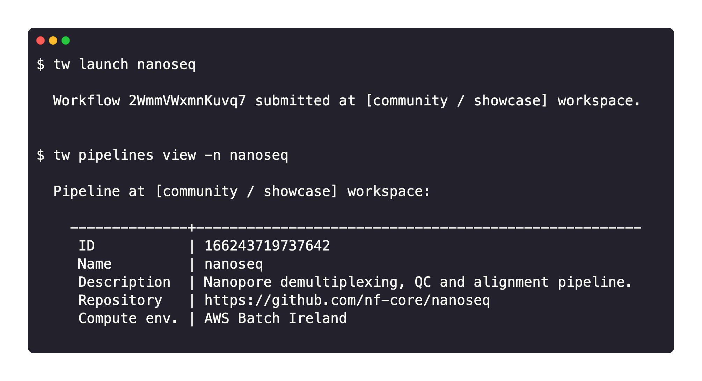

# Seqera Platform CLI

The command line is called `tw`. This allows you to manage elements like pipelines, actions, and compute environments in the terminal.

Seqera Platform is a full-stack application for the management of data pipelines and compute resources. It enables collaborative data analysis at scale, on-premises or in any cloud.

The CLI interacts with Seqera, providing an interface to launch pipelines, manage cloud resources, and administer your analysis.

### Key features

- **A Nextflow-like experience**: The CLI provides a developer-friendly environment. Pipelines can be launched with the CLI similar to Nextflow, but with the benefits of monitoring, logging, resource provisioning, dataset management, and collaborative sharing.

- **Infrastructure as code**: All Seqera resources, including pipelines and compute environments, can be described in a declarative manner. This allows a complete definition of an analysis environment that can be versioned and treated as code. It greatly simplifies sharing and reusing configurations and routine administration.

- **Built on OpenAPI**: The CLI interacts with Seqera via the [Seqera Platform API](../api/overview.mdx) which is created using the latest OpenAPI 3.0 specification. The CLI provides full control of the application, facilitating maximum insights into your pipeline submissions and execution environments.

### Availability

The CLI can be installed on macOS, Windows, and Linux.

Visit the [CLI](https://github.com/seqeralabs/tower-cli/) GitHub repository for installation and configuration details.
