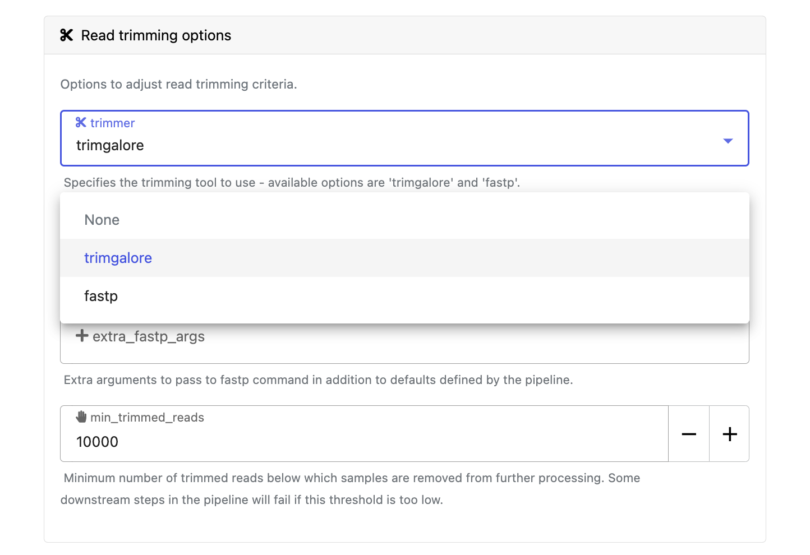

import Tabs from '@theme/Tabs';
import TabItem from '@theme/TabItem';

:::info
This tutorial provides an introduction to launching pipelines in Seqera Platform.

**Prerequisites:**
1. [Set up an organization and workspace](../workspace-setup.mdx).
1. Create a workspace [compute environment](../../compute-envs/overview.mdx) for your cloud or HPC compute infrastructure.
1. [Add a pipeline](./add-pipelines.mdx) to your workspace.
1. [Add your pipeline input data](./add-data.mdx).
:::

The Launchpad in every Platform workspace allows users to easily create and share Nextflow pipelines that can be executed on any supported infrastructure, including all public clouds and most HPC schedulers. A Launchpad pipeline consists of a pre-configured workflow Git repository, [compute environment](../../compute-envs/overview.mdx), and launch parameters.

## Launch a pipeline

:::note
This guide is based on version 3.15.1 of the [nf-core/rnaseq pipeline](https://github.com/nf-core/rnaseq). Launch form parameters and tools will differ for other pipelines. 
:::

Navigate to the Launchpad and select **Launch** next to your pipeline to open the launch form.

The launch form consists of **General config**, **Run parameters**, and **Advanced options** sections to specify your run parameters before execution, and an execution summary. Use section headings or select the **Previous** and **Next** buttons at the bottom of the page to navigate between sections. 

  
Nextflow parameter schema

  The launch form lets you configure the pipeline execution. The pipeline parameters in this form are rendered from a [pipeline schema](../../pipeline-schema/overview.mdx) file in the root of the pipeline Git repository. `nextflow_schema.json` is a simple JSON-based schema describing pipeline parameters for pipeline developers to easily adapt their in-house Nextflow pipelines to be executed in Platform.

  :::tip
  See [Best Practices for Deploying Pipelines with the Seqera Platform](https://seqera.io/blog/best-practices-for-deploying-pipelines-with-seqera-platform/) to learn how to build the parameter schema for any Nextflow pipeline automatically with tooling maintained by the nf-core community. 
  :::

### General config 

- **Pipeline to launch**: The pipeline Git repository name or URL. For saved pipelines, this is prefilled and cannot be edited.
- **Revision number**: A valid repository commit ID, tag, or branch name. For saved pipelines, this is prefilled and cannot be edited.
- **(Optional) Config profiles**: One or more [configuration profile](https://www.nextflow.io/docs/latest/config.html#config-profiles) names to use for the execution. 
- **Workflow run name**: An identifier for the run, pre-filled with a random name. This can be customized.
- **(Optional) Labels**: Assign new or existing [labels](../labels/overview.mdx) to the run.
- **Compute environment**: Select an existing workspace [compute environment](../../compute-envs/overview.mdx). 
- **Work directory**: The (cloud or local) file storage path where pipeline scratch data is stored. Platform will create a scratch sub-folder if only a cloud bucket location is specified.
  :::note
  The credentials associated with the compute environment must have access to the work directory.
  :::

### Run parameters 

There are three ways to enter **Run parameters** prior to launch:

- The **Input form view** displays form fields to enter text or select attributes from lists, and browse input and output locations with [Data Explorer](../../data/data-explorer.mdx).
- The **Config view** displays raw configuration text that you can edit directly. Select JSON or YAML format from the **View as** list.
- **Upload params file** allows you to upload a JSON or YAML file with run parameters.

Specify your pipeline input and output and modify other pipeline parameters as needed:

#### input

Use **Browse** to select your pipeline input data: 

- In the **Data Explorer** tab, select the existing cloud bucket that contains your samplesheet, browse or search for the samplesheet file, and select the chain icon to copy the file path before closing the data selection window and pasting the file path in the input field.
- In the **Datasets** tab, search for and select your existing dataset.

#### outdir

Use the `outdir` parameter to specify where the pipeline outputs are published. `outdir` must be unique for each pipeline run. Otherwise, your results will be overwritten. 

**Browse** and copy cloud storage directory paths using Data Explorer, or enter a path manually.

#### Pipeline-specific parameters

Modify other parameters to customize the pipeline execution through the parameters form. For example, in nf-core/rnaseq, change the `trimmer` under **Read trimming options** to `fastp` instead of `trimgalore`.

### Advanced settings 

- Use [resource labels](../../resource-labels/overview.mdx) to tag the computing resources created during the workflow execution. While resource labels for the run are inherited from the compute environment and pipeline, workspace admins can override them from the launch form. Applied resource label names must be unique. 
- [Pipeline secrets](../../secrets/overview.mdx) store keys and tokens used by workflow tasks to interact with external systems. Enter the names of any stored user or workspace secrets required for the workflow execution.
- See [Advanced options](../../launch/advanced.mdx) for more details.

After you have filled the necessary launch details, select **Launch**. The **Runs** tab shows your new run in a **submitted** status at the top of the list. Select the run name to navigate to the [**View Workflow Run**](../../monitoring/overview.mdx) page and view the configuration, parameters, status of individual tasks, and run report.