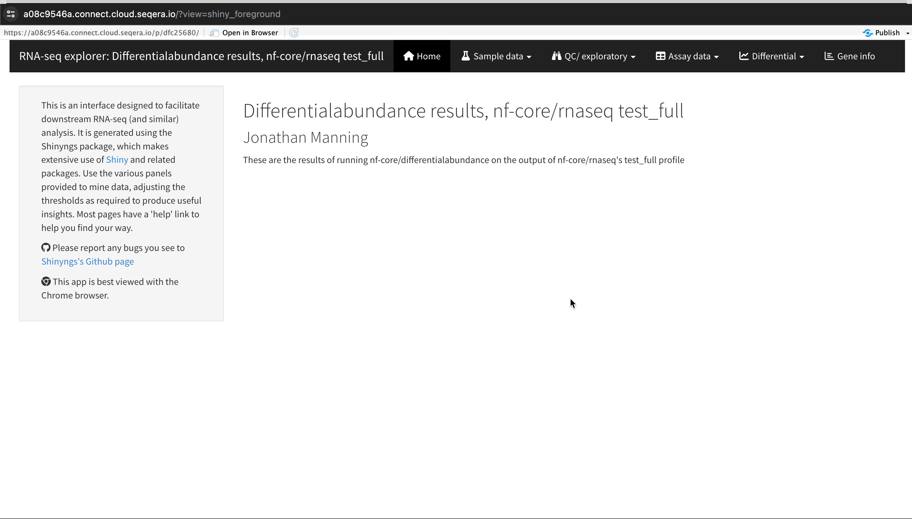
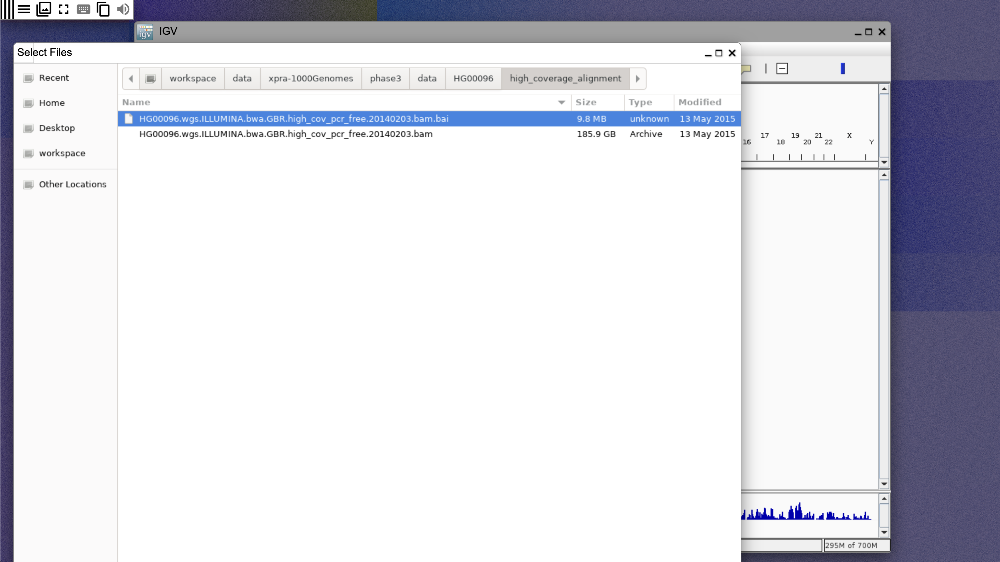
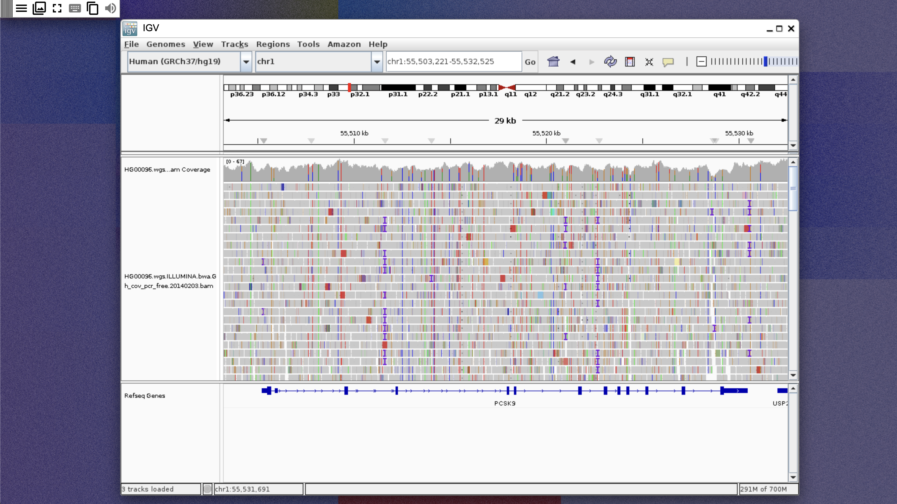

[Studios](../data_studios/index.mdx) allows users to host a variety of container images directly in Seqera Platform compute environments for analysis using popular environments including Jupyter (Python) and RStudio notebooks (R), Visual Studio Code IDEs, and Xpra remote desktops. Each studio session provides a dedicated interactive environment that encapsulates the live environment.

This guide explores how Studios integrates with your existing workflows, bridging the gap between pipeline execution and interactive analysis. It details how to set up and use each type of studio, demonstrating a practical use case for each.

:::info[**Prerequisites**]
You will need the following to get started:

- Valid credentials for your cloud storage account and compute environment
- To create and configure Studios, you need at least the "Maintain" workspace [user role](../orgs-and-teams/roles.mdx)
- An AWS Batch workspace compute environment (**without Fargate**) with sufficient resources (minimum: 2 CPUs, 8192 MB memory)
- [Data Explorer](../data/data-explorer.mdx) enabled in your workspace
:::

### Jupyter: Python-based visualization of protein structure prediction data 

Studios and Jupyter notebooks enable interactive analysis using Python libraries and tools. For example, PyMOL is a powerful tool used for visualizing and comparing structures produced by workflows such as [nf-core/proteinfold](https://nf-co.re/proteinfold/1.1.1), a bioinformatics best-practice analysis pipeline for protein 3D structure prediction. This section demonstrates how to create an AWS Batch compute environment, add the nf-core AWS megatests public proteinfold data to your workspace, create a Jupyter studio, and run the provided Python script to produce interactive composite 3D images of the H1065 sequence. 

:::note
This script and instructions can also be used to visualize the structures from nf-core/proteinfold runs performed with your own public or private data. 
:::

#### Create an AWS Batch compute environment 

Studios requires an AWS Batch compute environment. If you do not have an existing compute environment available, create one with the following attributes:

- **Region**: To reduce costs, your compute environment should be in the same region as your data. To browse the nf-core AWS megatests public data optimally, select **eu-west-1**.
- **Provisioning model**: Use **On-demand** EC2 instances. 
- Studios does not support AWS Fargate. Do not enable **Use Fargate for head job**. 
- At least 2 available CPUs and 8192 MB of RAM. 

#### Add data using Data Explorer

For the purposes of this guide, add the proteinfold results (H1065 sequence) from the nf-core AWS megatests S3 bucket to your workspace using Data Explorer:

1. From the **Data Explorer** tab, select **Add cloud bucket**. 
1. Specify the bucket details:
    - **Provider**: AWS
    - **Bucket path**: `s3://nf-core-awsmegatests/proteinfold/results-9bea0dc4ebb26358142afbcab3d7efd962d3a820`
    - A unique **Name** for the bucket, such as `nf-core-awsmegatests-proteinfold-h1065`.
    - **Credentials**: Select **Public** from the dropdown menu.
    - An optional bucket **Description**.
1. Select **Add**.

:::info 
To use your own pipeline data for interactive visualization, add the cloud bucket that contains the results of your nf-core/proteinfold pipeline run. See [Add a cloud bucket](./quickstart-demo/add-data.mdx#add-a-cloud-bucket) for more information. 
:::

#### Create a Jupyter notebook studio

From the **Data Studios** tab, select **Add a data studio** and complete the following:
- In the **Compute & Data** tab:
    - Select your AWS Batch compute environment. 
    - Optional: Enter CPU and memory allocations. The default values are 2 CPUs and 8192 MB memory (RAM).
        :::note
        Studios compete for computing resources when sharing compute environments. Ensure your shared compute environment has sufficient resources to run both your pipelines and studio sessions. 
        :::
    - Mount data using Data Explorer: Mount the S3 bucket or directory path that contains the nf-core AWS megatests proteinfold data, or the pipeline work directory of your nf-core/proteinfold run. 
- In the **General config** tab:
    - Select the latest **Jupyter** container image template from the list.
    - Optional: Enter a unique name and description for the data studio. 
    - Check **Install Conda packages** and paste the following Conda environment YAML snippet:
    ```yaml 
    channels:
    - schrodinger
    - conda-forge
    - bioconda
    dependencies:
    - python=3.10
    - schrodinger::pymol-bundle
    - conda-forge::libgl
    - pip
    - pip:
      - biopython==1.85
      - mdtraj==1.10.3
    ```
- Select **Add** or choose to **Add and start** the studio immediately.
- If you chose to **Add** the studio in the preceding step, select **Connect** in the options menu to open the studio in a new browser tab. 

#### Visualize protein structures 

The following Python script visualizes and compares protein structures produced by Alphafold 2 and ESMFold, creating a composite interactive 3D image of the two structures with contrasting colors. The script retrieves the CA atoms from both structures, checks whether the structures have the same number of CA atoms, creates a contact map, calculates the per-residue RMSD for each structure, and visualizes the structures, secondary structures, and per-residue RMSD using PyMOL. 

Run the following script in your Jupyter notebook to install the necessary packages and perform visualization:

<details>
<summary>Python script</summary>

    1. Import libraries:

        ```python 
        import py3Dmol
        from IPython.display import display
        from Bio import PDB
        from Bio.PDB import Superimposer
        import numpy as np
        ```

    1. Set up PDB file paths: 

        ```python 
        alphafold2_multimer_standard = "/workspace/data/nf-core-awsmegatests-proteinfold-h1065/mode_alphafold2_multimer/alphafold2/standard/H1065.alphafold.pdb"
        esmfold_multimer = "/workspace/data/nf-core-awsmegatests-proteinfold-h1065/mode_esmfold_multimer/esmfold/H1065.pdb"
        ```

    1. Load structures from the PDB files and retrieve lists of C-alpha atoms from both structures: 

        ```python 
        def align_structures(ref_pdb_path, mobile_pdb_path):
            """Align mobile structure to reference structure and return aligned coordinates"""
            # Set up parser
            parser = PDB.PDBParser()
            
            # Load structures
            ref_structure = parser.get_structure("reference", ref_pdb_path)
            mobile_structure = parser.get_structure("mobile", mobile_pdb_path)
            
            # Get lists of C-alpha atoms from both structures
            ref_atoms = []
            mobile_atoms = []
            
            for model in ref_structure:
                for chain in model:
                    for residue in chain:
                        if 'CA' in residue:
                            ref_atoms.append(residue['CA'])
                            
            for model in mobile_structure:
                for chain in model:
                    for residue in chain:
                        if 'CA' in residue:
                            mobile_atoms.append(residue['CA'])
        ```

    1. Align structures using Superimposer: 

        ```python 
        # Align structures using Superimposer
        super_imposer = Superimposer()
        super_imposer.set_atoms(ref_atoms, mobile_atoms)
        super_imposer.apply(mobile_structure.get_atoms())
        
        # Save aligned structure
        io = PDB.PDBIO()
        io.set_structure(mobile_structure)
        aligned_pdb_path = "./"+mobile_pdb_path.split("/")[-1].replace('.pdb', '_aligned.pdb')
        io.save(aligned_pdb_path)
        
        return aligned_pdb_path
        ```

    1. Create a view for a single structure: 

        ```python 
        def create_structure_view(pdb_path, color, width=400, height=400, label=None):
            """Create a view for a single structure"""
            view = py3Dmol.view(width=width, height=height)
            
            with open(pdb_path, 'r') as f:
                pdb_data = f.read()
            view.addModel(pdb_data, "pdb")
            view.setStyle({'model': -1}, {'cartoon': {'color': color}})
            view.zoomTo()
            
            if label:
                view.addLabel(label, {
                    'position': {'x': 0, 'y': 0, 'z': 0},
                    'backgroundColor': color,
                    'fontColor': 'white'
                })
            
            return view
        ```

    1. Create individual and combined structure views: 

        ```python 
        def visualize_structures(pdb1_path, pdb2_path):
            # Align the second structure to the first
            aligned_pdb2_path = align_structures(pdb1_path, pdb2_path)
            
            # Create three separate views
            view1 = create_structure_view(pdb1_path, 'blue', label="AlphaFold2")
            view2 = create_structure_view(aligned_pdb2_path, 'darkgrey', label="ESMFold")
            
            # Create combined view
            view3 = py3Dmol.view(width=800, height=400)
            
            # Load and display first structure (AlphaFold2)
            with open(pdb1_path, 'r') as f:
                pdb1_data = f.read()
            view3.addModel(pdb1_data, "pdb")
            view3.setStyle({'model': -1}, {'cartoon': {'color': 'blue'}})
            
            # Load and display aligned second structure (ESMFold)
            with open(aligned_pdb2_path, 'r') as f:
                pdb2_data = f.read()
            view3.addModel(pdb2_data, "pdb")
            view3.setStyle({'model': 1}, {'cartoon': {'color': 'darkgrey'}})
            
            # Set up the combined view
            view3.zoomTo()
            
            # Add labels for combined view
            view3.addLabel("AlphaFold2", {'position': {'x': -20, 'y': 0, 'z': 0}, 'backgroundColor': 'blue', 'fontColor': 'white'})
            view3.addLabel("ESMFold", {'position': {'x': 20, 'y': 0, 'z': 0}, 'backgroundColor': 'darkgrey', 'fontColor': 'white'})
            
            return view1, view2, view3        
        ```

    1. Display interactive 3D structure views: 

        ```python 
        # Visualize the structures
        view1, view2, view3 = visualize_structures(alphafold2_multimer_standard, esmfold_multimer)

        # Display all views
        print("AlphaFold2 Structure:")
        view1.show()
        print("\nESMFold Structure:")
        view2.show()
        print("\nAligned Structures:")
        view3.show()        
        ```

</details>    

### RStudio: Analyze RNASeq data and differential expression statistics 

Studios and RStudio notebooks enable interactive analysis using R libraries and tools. For example, Shiny for R enables you to render functions in a reactive application and build a custom user interface to explore your data. The public data used in this section consists of RNA sequencing data that was processed by the **nf-core/rnaseq** pipeline to quantify gene expression, followed by **nf-core/differentialabundance** to derive differential expression statistics. This section demonstrates how to create a studio to perform further analysis with these results from cloud storage. One of these outputs is an RShiny application that can be deployed for interactive analysis.

#### Create an AWS Batch compute environment 

Studios requires an AWS Batch compute environment. If you do not have an existing compute environment with at least 2 CPUs available, create one with the following attributes:

- **Region**: To reduce costs, your compute environment should be in the same region as your data. To browse the nf-core AWS megatests public data optimally, select **eu-west-1**.
- **Provisioning model**: Use **On-demand** EC2 instances. 
- Studios does not support AWS Fargate. Do not enable **Use Fargate for head job**. 
- At least 2 available CPUs.

#### Add data using Data Explorer

For the purposes of this guide, add the nf-core AWS megatests S3 bucket to your workspace using Data Explorer:

1. From the **Data Explorer** tab, select **Add cloud bucket**. 
1. Specify the bucket details:
    - **Provider**: AWS
    - **Bucket path**: `s3://nf-core-awsmegatests`
    - A unique **Name** for the bucket, such as `nf-core-awsmegatests`.
    - **Credentials**: Select **Public** from the dropdown menu.
    - An optional bucket **Description**.
1. Select **Add**.

:::info 
To use your own pipeline data for interactive analysis, add the cloud bucket that contains the results of your nf-core/differentialabundance pipeline run. See [Add a cloud bucket](./quickstart-demo/add-data.mdx#add-a-cloud-bucket) for more information. 
:::

#### Create an RStudio notebook studio 

From the **Data Studios** tab, select **Add a data studio** and complete the following:
- In the **Compute & Data** tab:
    - Select your AWS Batch compute environment. 
      :::note
      Data studios compete for computing resources when sharing compute environments. Ensure your compute environment has sufficient resources to run both your pipelines and data studio sessions. The default CPU and memory allocation for a data studio is 2 CPUs and 8192 MB RAM. 
      :::
    - Optional: Enter CPU and memory allocations. The default values are 2 CPUs and 8192 MB memory (RAM).
    - Mount data using Data Explorer: Mount the nf-core AWS megatests S3 bucket, or the directory path that contains the results of your nf-core/differentialabundance pipeline run. 
- In the **General config** tab:
    - Select the latest **RStudio** container image template from the list.
    - Optional: Enter a unique name and description for the data studio. 
- Select **Add** or choose to **Add and start** the studio immediately.
- If you chose to **Add** the studio in the preceding step, select **Start** in the options menu, then **Connect** to open the studio in a new browser tab when it is running. 


#### Perform the analysis and explore results

1. Configure the RStudio environment with installed packages, including [ShinyNGS](https://github.com/pinin4fjords/shinyngs):

    ```r 
    if (!require("BiocManager", quietly = TRUE))
      install.packages("BiocManager")

    BiocManager::install(version = "3.11", ask = FALSE)
    BiocManager::install(c("SummarizedExperiment", "GSEABase", "limma"))

    install.packages(c("devtools", "matrixStats", "rmarkdown", "markdown"))
    install.packages("shiny", repos = "https://cran.rstudio.com/")

    devtools::install_version("cpp11", version = "0.2.1", repos = "http://cran.us.r-project.org")
    devtools::install_github('pinin4fjords/shinyngs', upgrade_dependencies = FALSE)
    ```

1. Download the RDS file from nf-core AWS megatests or your own nf-core/differentialabundance results (see [Shiny app](https://nf-co.re/differentialabundance/1.5.0/docs/output/#shiny-app) from the nf-core documentation for file details): 

    ```r 
    # For nf-core AWS megatests
    download.file("https://nf-core-awsmegatests.s3-eu-west-1.amazonaws.com/differentialabundance/results-3dd360fed0dca1780db1bdf5dce85e5258fa2253/shinyngs_app/study/data.rds", 'data.rds')

    # For your nf-core/differentialabundance results, replace the URL with your RDS file URL)
    download.file("https://bucket.s3-region.amazonaws.com/differentialabundance/results/shinyngs_app/study-name/data.rds", 'data.rds')
    ```

1. Import libraries, read your RDS data, and launch the RShiny app:

    ```r 
    library(shinyngs)
    library(markdown)
    esel <- readRDS("data.rds")
    app <- prepareApp("rnaseq", esel)
    shiny::shinyApp(app$ui, app$server)
    ```



### Xpra: Visualize genetic variants with IGV

Studios and Xpra remote desktop technology enables many interactive analysis and troubleshooting workflows. One such workflow is to perform genetic variant visualization using IGV desktop, a powerful open-source tool for the visual exploration of genomic data. This section demonstrates how to add public data from the 1000 Genomes project to your workspace, set up an Xpra environment with IGV desktop pre-installed, and explore a variant of interest. 

#### Create an AWS Batch compute environment 

Studios requires an AWS Batch compute environment. If you do not have an existing compute environment with at least 2 CPUs available, create one with the following attributes:

- **Region**: To reduce costs, your compute environment should be in the same region as your data. To browse the 1000 Genomes public data optimally, select **us-east-1**.
- **Provisioning model**: Use **On-demand** EC2 instances. 
- Studios does not support AWS Fargate. Do not enable **Use Fargate for head job**. 
- At least 2 available CPUs.

#### Add data using Data Explorer

Add the 1000 Genomes S3 bucket to your workspace using Data Explorer:

1. From the **Data Explorer** tab, select **Add cloud bucket**. 
1. Specify the bucket details:
    - **Provider**: AWS
    - **Bucket path**: `s3://1000genomes`
    - A unique **Name** for the bucket, such as `1000G`.
    - **Credentials**: Select **Public** from the dropdown menu.
    - An optional bucket **Description**.
1. Select **Add**.

:::info 
To use your own data for interactive analysis, see [Add a cloud bucket](./quickstart-demo/add-data.mdx#add-a-cloud-bucket) for instructions to add your own public or private cloud bucket. 
:::

#### Create an Xpra studio 

From the **Data Studios** tab, select **Add a data studio** and complete the following:
- In the **Compute & Data** tab:
    - Select your AWS Batch compute environment. 
      :::note
      Studios compete for computing resources when sharing compute environments. Ensure your compute environment has sufficient resources to run both your pipelines and data studio sessions. The default CPU and memory allocation for a studio is 2 CPUs and 8192 MB RAM. 
      :::
    - Optional: Enter CPU and memory allocations.  
    - Mount the 1000 Genomes S3 bucket you added previously using Data Explorer. 
- In the **General config** tab:
    - Select the latest **Xpra** container image template from the list.
    - Optional: Enter a unique name and description for the studio. 
    - Check **Install Conda packages** and paste the following into the YML field:
        ```yaml 
        channels:
          - conda-forge
          - bioconda
        dependencies:
          - igv
          - samtools
        ```
- Select **Add** or choose to **Add and start** the studio immediately.
- If you chose to **Add** the studio in the preceding step, select **Connect** in the options menu to open the studio in a new browser tab. 

#### View variants in IGV desktop

1. In the Xpra terminal, run `igv` to open IGV desktop.
1. In IGV, change the genome version to hg19.
1. Select **File**, then **Load from file**, then navigate to `/workspace/data/xpra-1000Genomes/phase3/data/HG00096/high_coverage_alignment` and select the `.bai` file, as shown below:
    
1. Search for PCSK9 and zoom into one of the exons of the gene. A coverage graph and reads should be shown, as below:
    

### VS Code: Create an interactive Nextflow developer environment

Using Studios with VS Code allows you to set up a portable and interactive Nextflow developer environment that contains all the tools you need to code and run Nextflow pipelines. This section will demonstrate how to set up a VS Code Studio with Conda, nf-core tools, and Apptainer, add public data and run the nf-core/fetchngs pipeline with the `test` profile, and create a VS Code project to start coding your own Nextflow pipelines.  

#### Create an AWS Batch compute environment 

Studios requires an AWS Batch compute environment. If you do not have an existing compute environment with at least 4 CPUs available, create one with the following attributes:

- **Region**: To reduce costs, your compute environment should be in the same region as your data. To use the iGenomes public data bucket that contains the nf-core/fetchngs `test` profile data, select **eu-west-1**.
- **Provisioning model**: Use **On-demand** EC2 instances. 
- Studios does not support AWS Fargate. Do not enable **Use Fargate for head job**. 
- At least 4 available CPUs and 16384 MB memory (RAM).

#### Add data using Data Explorer 

The nf-core/fetchngs pipeline uses data from the NGI iGenomes public dataset for its `test` profile. To add this data to your workspace:

1. From the **Data Explorer** tab, select **Add cloud bucket**.
1. Specify the bucket details:
      - **Provider**: AWS
      - **Bucket path**: `s3://ngi-igenomes/test-data/`
      - A unique **Name** for the bucket: "ngi-igenomes-test-data", or similar
      - **Credentials**: **Public**.
      - An optional bucket **Description**.
1. Select **Add**.

#### Create a VS Code studio 

From the **Data Studios** tab, select **Add a data studio** and complete the following:
- In the **Compute & Data** tab:
    - Select your AWS Batch compute environment. 
      :::note
      Studios compete for computing resources when sharing compute environments. Shared compute environments must have sufficient resources to run both your pipelines and studio sessions.
      :::    
    - Allocate at least 4 CPUs and 8192 MB RAM. 
    - Mount data using Data Explorer: For the purposes of this guide, mount the NGI iGenomes S3 bucket you added previously. 
- In the **General config** tab:
    - Select the latest **VS Code** container image template from the list.
    - Optional: Enter a unique name and description for the studio. 
    - Check **Install Conda packages** and paste the following into the YML field:
        ```yaml
        channels:
          - conda-forge
          - bioconda
          - anaconda
        dependencies:
          - nf-core
          - conda
        ```
- Select **Add** or choose to **Add and start** the studio immediately.
- If you chose to **Add** the studio in the preceding step, select **Connect** in the options menu to open the studio in a new browser tab. 
- Once inside the studio, run `code.` to be able to use the clipboard.

#### Run nf-core/fetchngs with Conda 

Run the following Nextflow command to run nf-core/fetchngs with Conda:

```shell
nextflow run nf-core/fetchngs -profile test,conda --outdir ./nf-core-fetchngs-conda-out -resume
```

#### Write a Nextflow pipeline with nf-core tools 

- Run `nf-core pipelines create` to create a new pipeline. Choose which parts of the nf-core template you want to use.
- Run `code [your new pipeline]` to open the new pipeline as a project in VSCode. This allows you to code your pipeline with the help of the Nextflow language server and nf-core tools.

